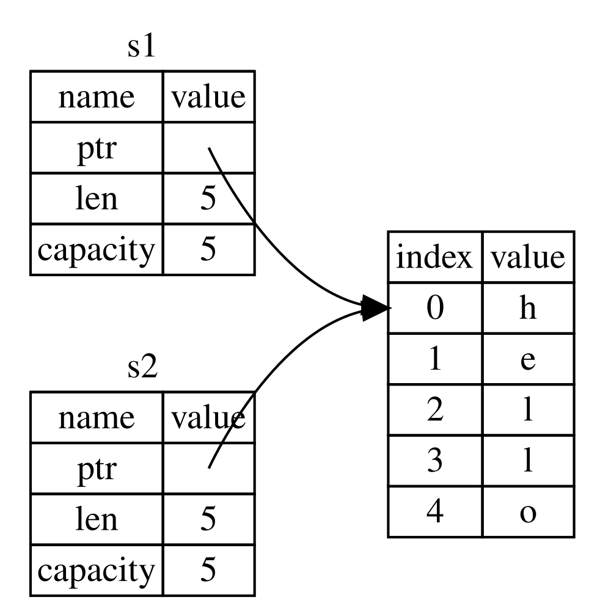
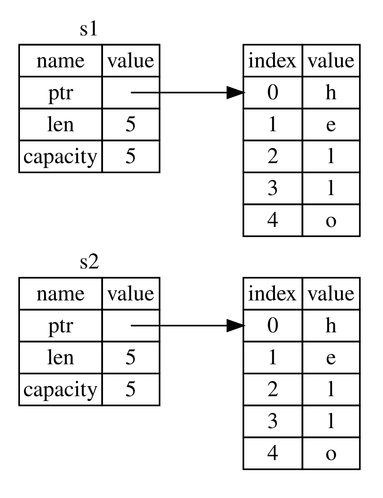
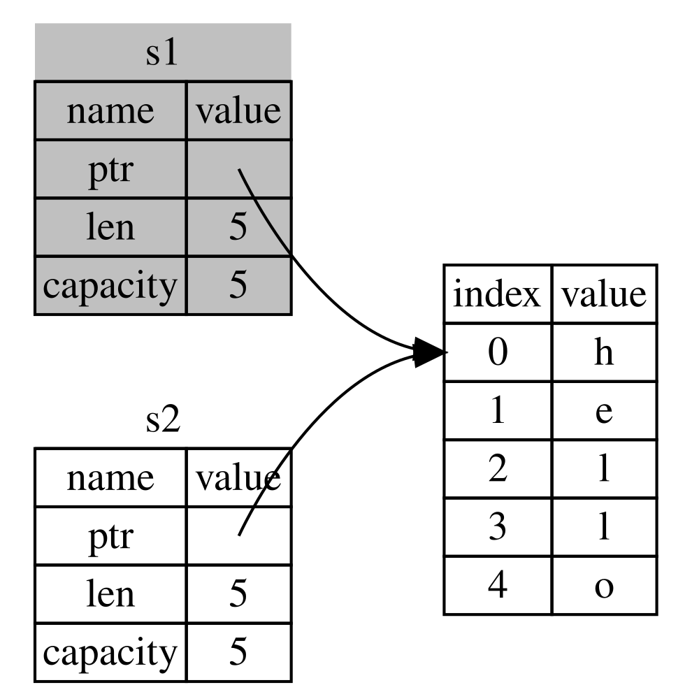

## ความเป็นเจ้าของคืออะไร?

_ระบบความเป็นเจ้าของ_ (ownership) คือชุดกฎเกณฑ์ที่ควบคุมวิธีที่โปรแกรม Rust จัดการกับหน่วยความจำ ทุกๆ โปรแกรมล้วนต้องจัดการกับการใช้งานหน่วยความจำของคอมพิวเตอร์ในขณะทำงาน ภาษาโปรแกรมบางภาษามีระบบเก็บขยะ (garbage collection) ที่คอยกวาดหาหน่วยความจำที่ไม่ได้ใช้งานแล้วอย่างต่อเนื่องในขณะที่โปรแกรมกำลังทำงาน ส่วนในภาษาอื่นๆ โปรแกรมเมอร์จะต้องเป็นผู้จัดสรร (allocate) และคืน (free) หน่วยความจำด้วยตนเองอย่างชัดเจน แต่ Rust เลือกใช้แนวทางที่สาม นั่นคือการจัดการหน่วยความจำผ่านระบบความเป็นเจ้าของ โดยมีชุดกฎเกณฑ์ที่คอมไพเลอร์จะคอยตรวจสอบตั้งแต่ตอนคอมไพล์ หากมีการละเมิดกฎข้อใดข้อหนึ่ง โปรแกรมจะไม่สามารถคอมไพล์ผ่านได้ และที่สำคัญคือ กลไกของระบบความเป็นเจ้าของนี้จะไม่สร้างภาระ (overhead) ใดๆ ที่ทำให้โปรแกรมทำงานช้าลงในขณะรันไทม์เลย

เนื่องจากระบบความเป็นเจ้าของเป็นแนวคิดที่ค่อนข้างใหม่สำหรับโปรแกรมเมอร์จำนวนมาก จึงอาจต้องใช้เวลาปรับตัวและทำความคุ้นเคยอยู่บ้าง แต่ข่าวดีก็คือ ยิ่งคุณเขียนโค้ด Rust และคุ้นเคยกับกฎของระบบความเป็นเจ้าของมากขึ้นเท่าใด คุณจะพบว่าการเขียนโค้ดให้ปลอดภัยและมีประสิทธิภาพสูงนั้นกลายเป็นเรื่องที่เป็นธรรมชาติขึ้นเรื่อยๆ ขอให้มุ่งมั่นต่อไป!

เมื่อคุณเข้าใจระบบความเป็นเจ้าของอย่างถ่องแท้ คุณก็จะมีรากฐานที่แข็งแกร่งสำหรับทำความเข้าใจฟีเจอร์อื่นๆ ที่ทำให้ Rust โดดเด่น ในบทนี้เราจะมาเรียนรู้เรื่องความเป็นเจ้าของผ่านตัวอย่างหลากหลายรูปแบบ โดยเน้นไปที่โครงสร้างข้อมูลที่ใช้งานบ่อยมากชนิดหนึ่ง นั่นก็คือสตริง

> ### สแตกและฮีป
>
> ในภาษาโปรแกรมหลายภาษา คุณอาจแทบไม่ต้องคำนึงถึงสแตก (stack) และฮีป (heap) บ่อยนัก แต่สำหรับภาษาโปรแกรมระดับระบบ (systems programming language) อย่าง Rust การที่ค่าของข้อมูลถูกจัดเก็บไว้บนสแตกหรือบนฮีปจะส่งผลโดยตรงต่อพฤติกรรมของภาษาและการตัดสินใจในการเขียนโค้ดของคุณ ในบทนี้เราจะอธิบายบางแง่มุมของระบบความเป็นเจ้าของโดยเชื่อมโยงกับสแตกและฮีป ดังนั้นเรามาทบทวนคำอธิบายสั้นๆ ของสองสิ่งนี้เพื่อเตรียมความพร้อมกันก่อน
>
> ทั้งสแตกและฮีปต่างก็เป็นส่วนหนึ่งของหน่วยความจำที่โปรแกรมสามารถเข้าใช้งานได้ในขณะรันไทม์ แต่โครงสร้างการทำงานของทั้งสองนั้นแตกต่างกันโดยสิ้นเชิง โดยสแตกจะจัดเก็บข้อมูลตามลำดับที่ได้รับเข้ามา และนำข้อมูลออกในลำดับย้อนกลับ ซึ่งเรียกว่า _เข้าทีหลังออกก่อน (last in, first out หรือ LIFO)_ ลองนึกภาพกองจาน เมื่อคุณวางจานเพิ่ม คุณจะวางไว้บนสุดของกอง และเมื่อต้องการหยิบจานไปใช้ คุณก็จะหยิบจานใบบนสุดออกไป การพยายามสอดจานเข้าหรือดึงจานออกจากตรงกลางหรือก้นกองย่อมไม่ใช่เรื่องที่ทำได้สะดวก การเพิ่มข้อมูลลงในสแตกจะเรียกว่า _การพุช (pushing onto the stack)_ และการนำข้อมูลออกจะเรียกว่า _การป็อป (popping off the stack)_ ข้อมูลทั้งหมดที่จะถูกจัดเก็บบนสแตกจะต้องมีขนาดที่แน่นอนและคงที่ตั้งแต่ตอนคอมไพล์ ส่วนข้อมูลที่ไม่ทราบขนาดล่วงหน้าตอนคอมไพล์ หรือขนาดอาจเปลี่ยนแปลงได้ตลอดเวลา จะต้องถูกนำไปจัดเก็บบนฮีปแทน
>
> ฮีปมีโครงสร้างที่เป็นระเบียบน้อยกว่า โดยเมื่อคุณต้องการเก็บข้อมูลบนฮีป โปรแกรมจะส่งคำขอพื้นที่ขนาดตามที่ต้องการไปยังตัวจัดสรรหน่วยความจำ (memory allocator) จากนั้นตัวจัดสรรจะค้นหาช่องว่างในฮีปที่มีขนาดใหญ่เพียงพอ ทำเครื่องหมายว่าพื้นที่นั้นกำลังถูกใช้งาน และส่งพอยน์เตอร์ (pointer) ซึ่งเป็นที่อยู่ (address) ของตำแหน่งดังกล่าวกลับมา กระบวนการนี้เรียกว่า _การจัดสรรหน่วยความจำบนฮีป (allocating on the heap)_ หรือมักเรียกสั้นๆ ว่า _การจัดสรร (allocating)_ (การพุชข้อมูลลงบนสแตกจะไม่ถือว่าเป็นการจัดสรร) เนื่องจากพอยน์เตอร์ที่ชี้ไปยังฮีปนั้นมีขนาดที่แน่นอนและคงที่ เราจึงสามารถเก็บตัวพอยน์เตอร์ไว้บนสแตกได้ แต่เมื่อใดที่เราต้องการเข้าถึงข้อมูลจริง เราจะต้องตามพอยน์เตอร์นั้นไปยังตำแหน่งบนฮีป ลองนึกภาพการไปรับประทานอาหารที่ร้านอาหาร เมื่อคุณมาถึง คุณจะแจ้งจำนวนคนที่ต้องการนั่ง พนักงานต้อนรับจะมองหาโต๊ะว่างที่ใหญ่พอสำหรับทุกคนและพาคุณไปนั่งที่โต๊ะนั้น หากเพื่อนของคุณตามมาทีหลัง พวกเขาก็สามารถถามพนักงานว่าโต๊ะของคุณอยู่ที่ไหนเพื่อเดินตามมาได้
>
> การพุชข้อมูลลงบนสแตกทำงานได้เร็วกว่าการจัดสรรพื้นที่บนฮีปมาก เนื่องจากตัวจัดสรรไม่จำเป็นต้องค้นหาพื้นที่ว่างใหม่เลย เพราะตำแหน่งที่จะวางข้อมูลจะอยู่ที่บนสุดของสแตกเสมอ ในทางตรงกันข้าม การจัดสรรพื้นที่บนฮีปต้องมีขั้นตอนการทำงานมากกว่า เพราะตัวจัดสรรต้องใช้เวลาค้นหาพื้นที่ว่างที่มีขนาดพอเหมาะก่อน จากนั้นจึงต้องบันทึกข้อมูลทางบัญชีเพื่อเตรียมพร้อมสำหรับการจัดสรรครั้งถัดไป
>
> นอกจากนี้ การเข้าถึงข้อมูลบนฮีปโดยทั่วไปยังช้ากว่าการเข้าถึงข้อมูลบนสแตก เนื่องจากโปรเซสเซอร์จะต้องตามพอยน์เตอร์ไปยังตำแหน่งข้อมูล โปรเซสเซอร์ยุคใหม่จะทำงานได้เร็วยิ่งขึ้นหากไม่ต้องกระโดดข้ามไปข้ามมาในหน่วยความจำ หากเปรียบเทียบกับพนักงานเสิร์ฟในร้านอาหารที่ต้องรับออร์เดอร์จากหลายโต๊ะ การรับออร์เดอร์จากโต๊ะหนึ่งให้ครบถ้วนก่อนจะเดินไปยังโต๊ะถัดไปย่อมมีประสิทธิภาพมากกว่าการรับออร์เดอร์จากโต๊ะ A สลับกับโต๊ะ B ไปมา ในทำนองเดียวกัน โปรเซสเซอร์จะทำงานได้เต็มประสิทธิภาพมากกว่าเมื่อประมวลผลข้อมูลที่อยู่ติดๆ กัน (เช่นข้อมูลที่เรียงอยู่บนสแตก) เมื่อเทียบกับข้อมูลที่กระจัดกระจายอยู่ห่างกัน (เช่นบนฮีป)
>
> เมื่อโปรแกรมเรียกใช้ฟังก์ชัน ค่าต่างๆ ที่ส่งเข้าไปในฟังก์ชัน (ซึ่งรวมถึงพอยน์เตอร์ที่ชี้ไปยังข้อมูลบนฮีป) ตลอดจนตัวแปรเฉพาะที่ (local variables) ของฟังก์ชันนั้น จะถูกพุชลงบนสแตก และเมื่อฟังก์ชันทำงานเสร็จสิ้น ค่าเหล่านั้นก็จะถูกป็อปออกจากสแตกทันที
>
> การคอยติดตามว่าโค้ดส่วนใดกำลังใช้งานข้อมูลใดบนฮีปอยู่, การลดข้อมูลที่ซ้ำซ้อนบนฮีปให้เหลือน้อยที่สุด, รวมถึงการตามล้างข้อมูลที่ไม่ได้ใช้งานแล้วบนฮีปเพื่อป้องกันไม่ให้หน่วยความจำเต็ม ล้วนเป็นภาระหน้าที่ที่ระบบความเป็นเจ้าของเข้ามาจัดการให้ เมื่อคุณเข้าใจระบบความเป็นเจ้าของแล้ว คุณอาจไม่จำเป็นต้องพะวงถึงสแตกและฮีปอยู่ตลอดเวลา แต่การตระหนักว่าเป้าหมายหลักประการหนึ่งของความเป็นเจ้าของคือการจัดการข้อมูลบนฮีป จะช่วยให้คุณเข้าใจได้อย่างถ่องแท้ว่าเหตุใด Rust จึงมีพฤติกรรมและการทำงานเช่นนี้

### กฎของความเป็นเจ้าของ

ก่อนอื่น เรามาดูกฎพื้นฐานของระบบความเป็นเจ้าของกัน ขอให้จำกฎเหล่านี้ให้ขึ้นใจในระหว่างที่เราศึกษาตัวอย่างต่างๆ ต่อไป:

- ค่าทุกค่าใน Rust จะต้องมี _เจ้าของ_ (owner) หนึ่งตัวเสมอ
- ค่าหนึ่งๆ จะมีเจ้าของได้เพียง _หนึ่งเดียว_ เท่านั้นในเวลาใดเวลาหนึ่ง
- เมื่อตัวแปรที่เป็นเจ้าของหลุดออกจากขอบเขต (scope) ค่านั้นจะถูกทำลายทิ้งทันที

### สโคปของตัวแปร

เนื่องจากเราได้ผ่านการเรียนรู้ไวยากรณ์พื้นฐานของ Rust มาแล้ว ในตัวอย่างต่อจากนี้เราจะไม่เขียนบล็อก `fn main() {` ซ้ำในทุกโค้ด ดังนั้นหากคุณทดลองเขียนโค้ดตาม อย่าลืมนำตัวอย่างเหล่านี้ไปใส่ไว้ในฟังก์ชัน `main` ด้วยตนเอง ซึ่งวิธีนี้จะช่วยให้ตัวอย่างโค้ดของเรากระชับขึ้น และช่วยให้เรามุ่งความสนใจไปที่รายละเอียดของเนื้อหาได้อย่างเต็มที่ โดยไม่ต้องมีโค้ดโครงสร้างซ้ำซ้อน

ในตัวอย่างแรกของเรื่องความเป็นเจ้าของ เราจะมาดูขอบเขต (scope) ของตัวแปรกัน _ขอบเขต_ (scope) คือช่วงของโปรแกรมที่ตัวแปรหรือไอเท็มนั้นๆ ยังคงสามารถใช้งานได้ ลองพิจารณาตัวแปรต่อไปนี้:

```rust
let s = "hello";
```

ตัวแปร `s` อ้างอิงไปยังสตริงลิเทอรัล (string literal) โดยค่าของสตริงจะถูกฝังอยู่ในตัวโปรแกรมของเราโดยตรง ตัวแปรนี้จะสามารถใช้งานได้ตั้งแต่จุดที่มันถูกประกาศไปจนกระทั่งสิ้นสุดขอบเขตปัจจุบัน ลิสติ้ง 4-1 แสดงตัวอย่างโปรแกรมพร้อมคอมเมนต์ที่ระบุช่วงที่ตัวแปร `s` มีผลใช้งานได้

<Listing number="4-1" caption="ตัวแปรและสโคปที่ตัวแปรนั้นใช้ได้">

```rust
{{#rustdoc_include ../listings/ch04-understanding-ownership/listing-04-01/src/main.rs:here}}
```

</Listing>

กล่าวอีกนัยหนึ่ง มีจุดเวลาที่สำคัญสองจุดด้วยกัน:

- เมื่อ `s` เข้า _สู่_ ขอบเขต มันจะเริ่มใช้งานได้
- และมันจะยังคงใช้งานได้ไปจนกระทั่งหลุดออก _จาก_ ขอบเขต

ณ จุดนี้ ความสัมพันธ์ระหว่างขอบเขตกับการใช้งานตัวแปรจะคล้ายคลึงกับภาษาโปรแกรมอื่นๆ ต่อไปเราจะต่อยอดจากความเข้าใจนี้โดยการแนะนำชนิดข้อมูล `String`

### ชนิด `String`

เพื่อแสดงให้เห็นการทำงานของกฎความเป็นเจ้าของ เราจำเป็นต้องใช้ชนิดข้อมูลที่มีความซับซ้อนกว่าชนิดข้อมูลที่เราเคยพูดถึงในหัวข้อ [“ชนิดข้อมูล”][data-types]<!-- ignore --> ในบทที่ 3 ชนิดข้อมูลที่ผ่านมาทั้งหมดมีขนาดที่แน่นอนตอนคอมไพล์ จึงสามารถจัดเก็บบนสแตกและป็อปออกจากสแตกได้ทันทีเมื่อหมดขอบเขตการทำงาน อีกทั้งยังสามารถคัดลอกค่าเพื่อสร้างอินสแตนซ์ใหม่ได้อย่างสะดวกรวดเร็วเมื่อโค้ดส่วนอื่นต้องการใช้ค่าเดียวกันในอีกขอบเขตหนึ่ง แต่ในตอนนี้เราต้องการศึกษาข้อมูลที่จัดเก็บบนฮีป เพื่อดูว่า Rust ทราบได้อย่างไรว่าเมื่อใดควรคืนหน่วยความจำเหล่านั้น และชนิดข้อมูล `String` ก็เป็นตัวอย่างที่ยอดเยี่ยมสำหรับการศึกษานี้

เราจะเน้นเฉพาะส่วนของ `String` ที่เกี่ยวข้องกับระบบความเป็นเจ้าของ ซึ่งหลักการเหล่านี้จะนำไปประยุกต์ใช้กับชนิดข้อมูลที่ซับซ้อนอื่นๆ ได้เช่นกัน ไม่ว่าจะเป็นชนิดข้อมูลที่ไลบรารีมาตรฐานจัดเตรียมไว้ให้ หรือชนิดข้อมูลที่คุณสร้างขึ้นมาเอง โดยเราจะเจาะลึกรายละเอียดแง่มุมอื่นๆ ของ `String` เพิ่มเติมใน [บทที่ 8][ch8]<!-- ignore -->

เราได้เห็นสตริงลิเทอรัลกันมาแล้ว ซึ่งค่าของข้อความจะถูกฝังตายตัวอยู่ในโปรแกรม แม้ว่าสตริงลิเทอรัลจะสะดวกและรวดเร็ว แต่ก็ไม่เหมาะกับทุกสถานการณ์ เพราะประการแรกคือ มันไม่สามารถแก้ไขเปลี่ยนแปลงค่าได้ (immutable) และประการที่สองคือ เราไม่สามารถทราบค่าของสตริงล่วงหน้าได้เสมอไปในตอนเขียนโค้ด เช่น ในกรณีที่เราต้องการรับข้อความอินพุตจากผู้ใช้แล้วนำมาเก็บไว้ ด้วยเหตุนี้ Rust จึงมีชนิดข้อมูล `String` เตรียมไว้ให้ โดยชนิดข้อมูลนี้จะจัดการข้อมูลที่จัดสรรอยู่บนฮีป จึงทำให้สามารถเก็บข้อความที่เราไม่ทราบขนาดล่วงหน้าตอนคอมไพล์ได้ คุณสามารถสร้าง `String` ขึ้นมาจากสตริงลิเทอรัลได้โดยใช้ฟังก์ชัน `from` ดังนี้:

```rust
let s = String::from("hello");
```

เครื่องหมายโคลอนคู่ `::` ช่วยให้เราสามารถระบุเนมสเปซของฟังก์ชัน `from` ภายใต้ชนิดข้อมูล `String` ได้ แทนที่จะต้องตั้งชื่อฟังก์ชันแยกต่างหากอย่างเช่น `string_from` เราจะอธิบายไวยากรณ์นี้เพิ่มเติมในหัวข้อ [“เมธอด”][methods]<!-- ignore --> ของบทที่ 5 และตอนที่พูดถึงการจัดการเนมสเปซด้วยมอดูลใน [“พาธสำหรับอ้างถึงรายการในแผนผังมอดูล”][paths-module-tree]<!-- ignore --> ในบทที่ 7

สตริงชนิดนี้ _สามารถ_ แก้ไขเปลี่ยนแปลงค่าได้:

```rust
{{#rustdoc_include ../listings/ch04-understanding-ownership/no-listing-01-can-mutate-string/src/main.rs:here}}
```

แล้วอะไรคือความแตกต่างตรงนี้? ทำไม `String` ถึงเปลี่ยนแปลงค่าได้ แต่สตริงลิเทอรัลกลับทำไม่ได้? ความแตกต่างอยู่ที่วิธีที่ชนิดข้อมูลทั้งสองจัดการกับหน่วยความจำ

### หน่วยความจำและการจัดสรร

ในกรณีของสตริงลิเทอรัล เรารู้เนื้อหาของข้อความล่วงหน้าตั้งแต่ตอนคอมไพล์ ข้อความจึงถูกฝังลงไปในไฟล์ไบนารีที่รันได้โดยตรง นี่คือเหตุผลที่สตริงลิเทอรัลมีความรวดเร็วและมีประสิทธิภาพสูงมาก แต่ข้อดีเหล่านี้เกิดขึ้นได้ก็เพราะความไม่สามารถเปลี่ยนแปลงค่าของมันเท่านั้น เราไม่สามารถจัดสรรพื้นที่หน่วยความจำลงในไฟล์ไบนารีล่วงหน้าสำหรับข้อความที่ยังไม่ทราบขนาดแน่ชัดตอนคอมไพล์ หรือข้อความที่มีขนาดขยายเพิ่มขึ้นได้ในขณะที่โปรแกรมกำลังทำงาน

สำหรับชนิดข้อมูล `String` เพื่อรองรับข้อความที่สามารถเปลี่ยนแปลงแก้ไขได้ (mutable) และขยายขนาดได้ เราจำเป็นต้องจัดสรรหน่วยความจำจำนวนหนึ่งบนฮีป ซึ่งไม่ทราบขนาดล่วงหน้าตอนคอมไพล์ เพื่อใช้จัดเก็บเนื้อหานั้น นั่นหมายความว่า:

- โปรแกรมจะต้องขอหน่วยความจำจากตัวจัดสรรหน่วยความจำ ณ เวลาทำงานจริง (runtime)
- เราต้องมีวิธีคืนหน่วยความจำนี้กลับไปยังตัวจัดสรรเมื่อเราใช้งาน `String` นั้นเสร็จสิ้นแล้ว

ในส่วนแรกนั้น เราเป็นผู้สั่งการเอง เมื่อเราเรียก `String::from` การทำงานภายในของฟังก์ชันจะทำหน้าที่ขอหน่วยความจำตามที่ต้องการ ซึ่งเป็นรูปแบบการทำงานตามปกติในภาษาโปรแกรมทั่วไป

อย่างไรก็ตาม ในส่วนที่สองนั้นมีความแตกต่างกันอย่างมาก ในภาษาที่มี _ตัวเก็บขยะ (garbage collector หรือ GC)_ ตัวเก็บขยะจะคอยตรวจสอบและคืนหน่วยความจำที่ไม่ได้ใช้งานแล้วให้โดยอัตโนมัติ ทำให้โปรแกรมเมอร์ไม่ต้องกังวลกับเรื่องนี้ ส่วนในภาษาโปรแกรมส่วนใหญ่ที่ไม่มีตัวเก็บขยะ จะเป็นหน้าที่ของโปรแกรมเมอร์เองที่จะต้องคอยระบุว่าเมื่อใดที่หน่วยความจำนั้นไม่ถูกใช้งานแล้ว และต้องเขียนคำสั่งเพื่อคืนหน่วยความจำนั้นอย่างชัดเจน เช่นเดียวกับตอนที่ขอพื้นที่มา ซึ่งการจัดการเรื่องนี้ให้ถูกต้องและครบถ้วนถือเป็นปัญหาที่ยากมากในการเขียนโปรแกรม หากเราลืมคืนหน่วยความจำ ก็จะเกิดปัญหาหน่วยความจำรั่วไหล (memory leak) แต่หากเราคืนหน่วยความจำเร็วเกินไป ตัวแปรที่ยังต้องใช้งานอยู่ก็จะไม่ถูกต้อง และหากเราเผลอคืนหน่วยความจำซ้ำสองครั้ง ก็จะเกิดบั๊กขึ้นมาอีก ดังนั้นเราจึงจำเป็นต้องจับคู่คำสั่งจอง (`allocate`) และคำสั่งคืน (`free`) ให้ตรงกันอย่างสมบูรณ์แบบพอดีหนึ่งต่อหนึ่งเสมอ

Rust เลือกใช้แนวทางที่แตกต่างออกไป นั่นคือ **หน่วยความจำจะถูกคืนให้โดยอัตโนมัติทันทีที่ตัวแปรที่เป็นเจ้าของหลุดออกจากขอบเขต (scope)** ตัวอย่างต่อไปนี้คือการปรับปรุงโค้ดจากลิสติ้ง 4-1 โดยเปลี่ยนมาใช้ `String` แทนสตริงลิเทอรัล:

```rust
{{#rustdoc_include ../listings/ch04-understanding-ownership/no-listing-02-string-scope/src/main.rs:here}}
```

มีจุดหนึ่งที่เราสามารถคืนหน่วยความจำที่ `String` ร้องขอไว้กลับไปยังตัวจัดสรรได้อย่างเป็นธรรมชาติที่สุด นั่นคือจุดที่ตัวแปร `s` หลุดออกจากขอบเขต เมื่อตัวแปรหลุดออกจากขอบเขต Rust จะเรียกใช้ฟังก์ชันพิเศษตัวหนึ่งให้เราโดยอัตโนมัติ ฟังก์ชันนี้มีชื่อว่า `drop` ซึ่งเป็นจุดที่ผู้พัฒนาชนิดข้อมูล `String` ได้เขียนโค้ดสำหรับคืนหน่วยความจำเอาไว้ โดย Rust จะสั่งเรียกฟังก์ชัน `drop` นี้ให้อัตโนมัติเมื่อโปรแกรมทำงานมาถึงเครื่องหมายวงเล็บปีกกาปิด

> หมายเหตุ: ในภาษา C++ รูปแบบการคืนทรัพยากรเมื่อสิ้นสุดอายุขัย (lifetime) ของออบเจกต์ในลักษณะนี้มักจะเรียกว่า _Resource Acquisition Is Initialization (RAII)_ ดังนั้นฟังก์ชัน `drop` ใน Rust จะดูคุ้นเคยอย่างยิ่งสำหรับผู้ที่เคยมีประสบการณ์กับรูปแบบ RAII มาก่อน

รูปแบบการทำงานนี้ส่งผลอย่างลึกซึ้งต่อแนวทางการเขียนโค้ดใน Rust ในตอนนี้มันอาจจะดูเรียบง่ายตรงไปตรงมา แต่พฤติกรรมของโค้ดอาจแสดงผลลัพธ์ที่คาดไม่ถึงได้ในสถานการณ์ที่ซับซ้อนยิ่งขึ้น เมื่อเราต้องการให้ตัวแปรหลายตัวทำงานร่วมกับข้อมูลชุดเดียวกันที่จัดสรรไว้บนฮีป เราลองมาดูสถานการณ์เหล่านั้นกันต่อ

<!-- Old headings. Do not remove or links may break. -->

<a id="ways-variables-and-data-interact-move"></a>

#### ตัวแปรและข้อมูลที่ปฏิสัมพันธ์กันด้วยการย้ายค่า

ตัวแปรหลายตัวสามารถมีปฏิสัมพันธ์กับข้อมูลชุดเดียวกันได้ในหลายรูปแบบใน Rust ลิสติ้ง 4-2 แสดงตัวอย่างที่ใช้ชนิดข้อมูลจำนวนเต็ม (integer)

<Listing number="4-2" caption="การกำหนดค่าจำนวนเต็มของตัวแปร `x` ให้ `y`">

```rust
{{#rustdoc_include ../listings/ch04-understanding-ownership/listing-04-02/src/main.rs:here}}
```

</Listing>

เราน่าจะพอเดาได้ว่าโค้ดนี้ทำงานอย่างไร: “นำค่า `5` ไปผูกเข้ากับ `x` จากนั้นคัดลอกค่าใน `x` แล้วนำไปผูกเข้ากับ `y`” ในตอนนี้เรามีตัวแปรสองตัวคือ `x` และ `y` ซึ่งต่างก็มีค่าเป็น `5` ทั้งคู่ และนั่นคือสิ่งที่เกิดขึ้นจริง เนื่องจากจำนวนเต็มเป็นค่าข้อมูลพื้นฐานที่เรียบง่าย มีขนาดที่แน่นอนและคงที่ ค่า `5` ทั้งสองค่านี้จึงถูกพุชลงบนสแตกโดยตรง

ทีนี้ลองมาดูตัวอย่างเดียวกันแต่เปลี่ยนมาใช้ `String` กันบ้าง:

```rust
{{#rustdoc_include ../listings/ch04-understanding-ownership/no-listing-03-string-move/src/main.rs:here}}
```

โค้ดนี้ดูคล้ายคลึงกันมาก จนเราอาจสันนิษฐานว่ามันน่าจะทำงานเหมือนกัน นั่นคือ บรรทัดที่สองจะทำการคัดลอกค่าใน `s1` แล้วนำไปผูกกับ `s2` แต่ในความเป็นจริงแล้วไม่ได้เป็นเช่นนั้นเลย

ลองดูรูปที่ 4-1 เพื่อทำความเข้าใจสิ่งที่เกิดขึ้นเบื้องหลังของ `String` โดย `String` จะประกอบด้วย 3 ส่วนตามที่แสดงทางด้านซ้าย ได้แก่ พอยน์เตอร์ที่ชี้ไปยังหน่วยความจำที่เก็บเนื้อหาของสตริง, ความยาว (length), และความจุ (capacity) ข้อมูลกลุ่มนี้จะถูกจัดเก็บบนสแตก ส่วนทางด้านขวาคือพื้นที่หน่วยความจำบนฮีปที่ใช้เก็บเนื้อหาข้อความจริงๆ


<span class="caption">รูปที่ 4-1: การแทนค่าในหน่วยความจำของ `String` ที่เก็บค่า `"hello"` ซึ่งผูกกับ `s1`</span>

ความยาว (length) คือขนาดของเนื้อหาข้อความใน `String` ณ ขณะนั้นในหน่วยไบต์ ส่วนความจุ (capacity) คือขนาดหน่วยความจำทั้งหมดที่ `String` ได้รับมาจากตัวจัดสรรในหน่วยไบต์ ความแตกต่างระหว่างความยาวและความจุนั้นมีความสำคัญ แต่ในบริบทนี้เรายังไม่จำเป็นต้องลงลึกถึงเรื่องความจุ

เมื่อเรากำหนดค่า `s1` ให้กับ `s2` ข้อมูลส่วนหัวของ `String` จะถูกคัดลอก ซึ่งหมายความว่าเราคัดลอกพอยน์เตอร์, ความยาว, และความจุที่อยู่บนสแตก แต่เรา **ไม่ได้** คัดลอกข้อมูลเนื้อหาข้อความที่อยู่บนฮีปที่พอยน์เตอร์ชี้ไปแต่อย่างใด กล่าวอีกนัยหนึ่ง การแทนค่าในหน่วยความจำจะมีลักษณะดังรูปที่ 4-2



<span class="caption">รูปที่ 4-2: การแทนค่าในหน่วยความจำของตัวแปร `s2` ที่มีสำเนาของพอยน์เตอร์ ความยาว และความจุของ `s1`</span>

การแทนค่านี้ **ไม่เหมือน** กับในรูปที่ 4-3 ซึ่งเป็นสิ่งที่จะเกิดขึ้นหาก Rust ทำการคัดลอกข้อมูลทั้งหมดบนฮีปไปด้วย หาก Rust ทำงานเช่นนั้น การดำเนินการ `s2 = s1` ย่อมส่งผลกระทบต่อประสิทธิภาพการทำงานในตอนรันไทม์อย่างมาก หากข้อมูลบนฮีปมีขนาดใหญ่



<span class="caption">รูปที่ 4-3: ความเป็นไปได้อีกอย่างหนึ่งสำหรับสิ่งที่ `s2 = s1` อาจทำ หาก Rust คัดลอกข้อมูลบนฮีปด้วย</span>

ก่อนหน้านี้เราได้กล่าวไปว่า เมื่อตัวแปรหลุดออกจากขอบเขต Rust จะเรียกใช้ฟังก์ชัน `drop` โดยอัตโนมัติเพื่อล้างหน่วยความจำบนฮีปของตัวแปรนั้น แต่จากรูปที่ 4-2 จะเห็นว่าพอยน์เตอร์ของตัวแปรทั้งสองตัวต่างชี้ไปยังตำแหน่งเดียวกันบนฮีป ซึ่งนี่คือปัญหาสำคัญ เพราะเมื่อ `s2` และ `s1` หลุดออกจากขอบเขต ตัวแปรทั้งสองจะพยายามสั่งคืนหน่วยความจำที่ตำแหน่งเดียวกัน ซึ่งข้อผิดพลาดนี้เรียกว่า _การคืนหน่วยความจำซ้ำซ้อน (double free)_ และเป็นหนึ่งในบั๊กความปลอดภัยของหน่วยความจำที่อันตรายอย่างยิ่ง การคืนหน่วยความจำตำแหน่งเดิมสองครั้งอาจนำไปสู่ความเสียหายของข้อมูลในหน่วยความจำ (memory corruption) และก่อให้เกิดช่องโหว่ด้านความปลอดภัยได้

เพื่อรับประกันความปลอดภัยของหน่วยความจำ หลังจากบรรทัด `let s2 = s1;` ทำงาน Rust จะถือว่าตัวแปร `s1` **ใช้งานไม่ได้อีกต่อไป (invalid)** ด้วยเหตุนี้ Rust จึงไม่ต้องคืนหน่วยความจำใดๆ เมื่อ `s1` หลุดออกจากขอบเขต ลองมาดูว่าจะเกิดอะไรขึ้นเมื่อคุณพยายามนำ `s1` มาใช้งานต่อหลังจากสร้าง `s2` ไปแล้ว:

```rust,ignore,does_not_compile
{{#rustdoc_include ../listings/ch04-understanding-ownership/no-listing-04-cant-use-after-move/src/main.rs:here}}
```

คุณจะพบกับข้อผิดพลาดในการคอมไพล์ เนื่องจาก Rust ป้องกันไม่ให้คุณใช้งานตัวแปรที่ถูกทำให้ใช้การไม่ได้ไปแล้ว:

```console
{{#include ../listings/ch04-understanding-ownership/no-listing-04-cant-use-after-move/output.txt}}
```

หากคุณคุ้นเคยกับคำว่า _การคัดลอกแบบตื้น_ (shallow copy) และ _การคัดลอกแบบลึก_ (deep copy) จากภาษาอื่นๆ แนวคิดของการคัดลอกพอยน์เตอร์, ความยาว, และความจุ โดยไม่ได้คัดลอกข้อมูลจริงบนฮีป อาจฟังดูคล้ายกับการคัดลอกแบบตื้น แต่เนื่องจาก Rust ได้ทำให้ตัวแปรเดิมหมดสภาพการใช้งานไปด้วย แทนที่จะเรียกว่าการคัดลอกแบบตื้น ใน Rust เราจึงเรียกพฤติกรรมนี้ว่า **การย้ายค่า (move)** ในตัวอย่างนี้ เราจะพูดว่า `s1` ถูก _ย้าย_ ไปยัง `s2` แล้ว ดังนั้นสิ่งที่เกิดขึ้นจริงในหน่วยความจำจึงเป็นไปตามรูปที่ 4-4



<span class="caption">รูปที่ 4-4: การแทนค่าในหน่วยความจำหลังจากที่ `s1` ถูกทำให้ไม่ถูกต้อง</span>

และนั่นช่วยแก้ปัญหาของเราได้ทั้งหมด! เมื่อมีเพียง `s2` เท่านั้นที่ยังใช้งานได้ เมื่อ `s2` หลุดออกจากขอบเขต ก็จะมีเพียงมันตัวเดียวเท่านั้นที่สั่งคืนหน่วยความจำ เป็นอันเสร็จสิ้นกระบวนการอย่างปลอดภัย

นอกจากนี้ การออกแบบนี้ยังให้ผลลัพธ์โดยนัยที่สำคัญคือ Rust จะไม่มีวันสร้างสำเนาข้อมูลแบบลึก (deep copy) ให้อัตโนมัติ ดังนั้นการคัดลอกข้อมูลแบบ _อัตโนมัติ_ ใดๆ ใน Rust จึงมั่นใจได้ว่าจะทำงานได้อย่างรวดเร็วและไม่กระทบต่อประสิทธิภาพการทำงานในตอนรันไทม์อย่างแน่นอน

#### สโคปและการกำหนดค่า

ในทางตรงกันข้าม ความสัมพันธ์ระหว่างขอบเขต, ความเป็นเจ้าของ, และการคืนหน่วยความจำผ่านฟังก์ชัน `drop` ก็ทำงานเมื่อมีการกำหนดค่าใหม่ให้กับตัวแปรเดิมเช่นกัน กล่าวคือ เมื่อคุณกำหนดค่าใหม่ให้กับตัวแปรเดิมที่มีอยู่แล้ว Rust จะสั่งเรียก `drop` เพื่อคืนหน่วยความจำของค่าเดิมนั้นทิ้งทันที ลองพิจารณาตัวอย่างโค้ดนี้:

```rust
{{#rustdoc_include ../listings/ch04-understanding-ownership/no-listing-04b-replacement-drop/src/main.rs:here}}
```

เราเริ่มต้นจากการประกาศตัวแปร `s` และผูกเข้ากับ `String` ที่มีค่า `"hello"` จากนั้นเราได้สร้าง `String` ตัวใหม่ที่มีค่า `"ahoy"` ขึ้นมา แล้วกำหนดทับลงไปในตัวแปร `s` ทันที ณ จุดนี้ ไม่มีสิ่งใดอ้างอิงถึงข้อมูลเดิมบนฮีปอีกต่อไป รูปที่ 4-5 แสดงสถานะของหน่วยความจำบนสแตกและฮีปในจังหวะนี้:


<span class="caption">รูปที่ 4-5: การแทนค่าในหน่วยความจำหลังจากที่ค่าเริ่มต้นถูกแทนที่ทั้งหมดแล้ว</span>

สตริงเดิมจึงหลุดออกจากขอบเขตการใช้งานทันที Rust จะสั่งรันฟังก์ชัน `drop` กับสตริงเดิมนั้นเพื่อคืนหน่วยความจำของมันกลับไปโดยไม่รอช้า และเมื่อเราพิมพ์ค่าของตัวแปรในตอนท้าย ผลลัพธ์ที่ได้จึงเป็น `"ahoy, world!"`

<!-- Old headings. Do not remove or links may break. -->

<a id="ways-variables-and-data-interact-clone"></a>

#### ตัวแปรและข้อมูลที่ปฏิสัมพันธ์กันด้วยการโคลน

หากเรา _ต้องการ_ คัดลอกข้อมูลทั้งหมดบนฮีปของ `String` แบบลึกจริงๆ ไม่ใช่เพียงแค่ข้อมูลส่วนหัวบนสแตก เราสามารถเรียกใช้เมธอดทั่วไปที่ชื่อว่า `clone` ได้ เราจะพูดถึงไวยากรณ์ของเมธอดอย่างละเอียดในบทที่ 5 แต่เนื่องจากเมธอดเป็นฟีเจอร์พื้นฐานในภาษาโปรแกรมหลายภาษา คุณจึงน่าจะคุ้นเคยกับรูปแบบนี้มาบ้างแล้ว

นี่คือตัวอย่างการเรียกใช้งานเมธอด `clone`:

```rust
{{#rustdoc_include ../listings/ch04-understanding-ownership/no-listing-05-clone/src/main.rs:here}}
```

โค้ดนี้ทำงานได้อย่างสมบูรณ์ และทำให้เกิดพฤติกรรมตามที่แสดงในรูปที่ 4-3 อย่างชัดเจน โดยที่ข้อมูลบนฮีปจะ _ถูกคัดลอก_ สำเนาขึ้นมาใหม่อีกชุดหนึ่งจริงๆ

เมื่อคุณเห็นการเรียกใช้ `clone` ในโค้ด คุณจะทราบได้ทันทีว่ากำลังมีโค้ดบางอย่างทำงานอยู่เบื้องหลัง และการทำงานนั้นอาจมีค่าใช้จ่ายทางทรัพยากรสูง ซึ่งเป็นจุดสังเกตที่ชัดเจนว่ากำลังมีการประมวลผลพิเศษเกิดขึ้น

#### ข้อมูลบนสแตกเท่านั้น: การคัดลอกค่า

ยังมีอีกหนึ่งประเด็นที่น่าสนใจและเรายังไม่ได้พูดถึง ลองพิจารณาโค้ดที่ใช้ชนิดข้อมูลจำนวนเต็มนี้ ซึ่งส่วนหนึ่งเคยปรากฏในลิสติ้ง 4-2:

```rust
{{#rustdoc_include ../listings/ch04-understanding-ownership/no-listing-06-copy/src/main.rs:here}}
```

แต่โค้ดชุดนี้ดูเหมือนจะขัดแย้งกับสิ่งที่เราเพิ่งเรียนรู้มา เพราะเราไม่ได้เรียก `clone` แต่ตัวแปร `x` ก็ยังคงสามารถใช้งานได้ตามปกติ โดยไม่ได้ถูกย้ายค่าไปยัง `y` แต่อย่างใด

เหตุผลก็คือ ชนิดข้อมูลพื้นฐานอย่างจำนวนเต็มที่มีขนาดแน่นอนตอนคอมไพล์จะถูกจัดเก็บบนสแตกทั้งหมด การทำสำเนาของค่าจริงจึงทำได้อย่างรวดเร็วมาก นั่นหมายความว่าไม่มีเหตุผลใดที่จำเป็นต้องทำให้ตัวแปร `x` หมดสภาพไปหลังจากสร้างตัวแปร `y` ขึ้นมา กล่าวอีกนัยหนึ่ง สำหรับข้อมูลประเภทนี้แล้ว ไม่มีความแตกต่างใดๆ ระหว่างการคัดลอกแบบลึกกับการคัดลอกแบบตื้นเลย ดังนั้นการเรียกใช้ `clone` ในกรณีนี้จึงไม่มีผลแตกต่างจากการคัดลอกแบบตื้นทั่วไป เราจึงละเว้นไม่ต้องเรียกใช้มันได้

ใน Rust มีแอตทริบิวต์พิเศษที่เรียกว่าเทรต `Copy` (Copy trait) ซึ่งเราสามารถนำไปกำหนดให้กับชนิดข้อมูลที่จัดเก็บบนสแตกได้อย่างจำนวนเต็ม (เราจะเจาะลึกเรื่องเทรตเพิ่มเติมใน [บทที่ 10][traits]<!-- ignore -->) หากชนิดข้อมูลใดอิมพลีเมนต์เทรต `Copy` ตัวแปรของชนิดข้อมูลนั้นจะไม่ถูกย้ายค่า แต่จะถูกคัดลอกค่าอย่างรวดเร็วแทน ทำให้ตัวแปรเดิมยังคงใช้งานต่อไปได้แม้จะถูกนำไปกำหนดให้กับตัวแปรอื่นแล้วก็ตาม

Rust จะไม่อนุญาตให้เรากำหนดเทรต `Copy` ให้กับชนิดข้อมูลใดๆ ก็ตาม หากชนิดข้อมูลนั้น (หรือส่วนประกอบใดๆ ในนั้น) มีการอิมพลีเมนต์เทรต `Drop` เอาไว้ หากชนิดข้อมูลต้องการให้มีการทำงานพิเศษบางอย่างเมื่อค่าหลุดออกจากขอบเขต แล้วเราพยายามไปใส่เทรต `Copy` ให้กับมัน คอมไพเลอร์จะแจ้งเตือนข้อผิดพลาดทันที หากต้องการศึกษาวิธีการกำหนดเทรต `Copy` ให้กับชนิดข้อมูลที่คุณสร้างขึ้น สามารถดูได้จากหัวข้อ [“เทรตที่ derive ได้”][derivable-traits]<!-- ignore --> ในภาคผนวก C

แล้วมีชนิดข้อมูลใดบ้างที่อิมพลีเมนต์เทรต `Copy`? คุณสามารถตรวจสอบเอกสารของแต่ละชนิดข้อมูลเพื่อให้แน่ใจได้ แต่ตามหลักการทั่วไปแล้ว ชนิดข้อมูลสเกลาร์ (scalar types) แบบเรียบง่ายส่วนใหญ่จะอิมพลีเมนต์ `Copy` และจะไม่มีชนิดข้อมูลใดที่มีการจัดสรรหน่วยความจำหรือถือครองทรัพยากรภายนอกที่สามารถอิมพลีเมนต์ `Copy` ได้ ตัวอย่างของชนิดข้อมูลที่อิมพลีเมนต์ `Copy` ได้แก่:

- ชนิดข้อมูลจำนวนเต็มทั้งหมด เช่น `u32`
- ชนิดข้อมูลบูลีน `bool` ซึ่งมีค่าเป็น `true` และ `false`
- ชนิดข้อมูลทศนิยมทั้งหมด เช่น `f64`
- ชนิดข้อมูลอักขระ `char`
- ทูเพิล (tuple) หากสมาชิกทุกตัวในทูเพิลนั้นอิมพลีเมนต์ `Copy` ด้วย เช่น `(i32, i32)` จะอิมพลีเมนต์ `Copy` แต่ `(i32, String)` จะไม่อิมพลีเมนต์

### ความเป็นเจ้าของและฟังก์ชัน

กลไกการส่งค่าเข้าไปยังฟังก์ชันนั้นทำงานคล้ายคลึงกับการกำหนดค่าให้กับตัวแปรทุกประการ การส่งตัวแปรเข้าไปในฟังก์ชันจะทำให้เกิดการย้ายค่า (move) หรือการคัดลอกค่า (copy) เช่นเดียวกับการกำหนดค่า ตัวอย่างในลิสติ้ง 4-3 แสดงให้เห็นตำแหน่งที่ตัวแปรเข้าสู่ขอบเขตและหลุดออกจากขอบเขตอย่างชัดเจน

<Listing number="4-3" file-name="src/main.rs" caption="ฟังก์ชันพร้อมคำอธิบายประกอบเรื่องความเป็นเจ้าของและสโคป">

```rust
{{#rustdoc_include ../listings/ch04-understanding-ownership/listing-04-03/src/main.rs}}
```

</Listing>

หากเราพยายามนำตัวแปร `s` มาใช้งานต่อหลังจากการเรียก `takes_ownership` คอมไพเลอร์ของ Rust จะแจ้งข้อผิดพลาดทันที การตรวจสอบอย่างเข้มงวดตั้งแต่ตอนคอมไพล์นี้ช่วยปกป้องเราจากข้อผิดพลาดร้ายแรงได้อย่างมั่นใจ ลองเพิ่มโค้ดในฟังก์ชัน `main` เพื่อทดลองใช้งาน `s` และ `x` ดู เพื่อสังเกตจุดที่คุณสามารถใช้งานตัวแปรได้ และจุดที่กฎความเป็นเจ้าของป้องกันไม่ให้คุณใช้งาน

### ค่าที่คืนกลับและสโคป

การคืนค่าจากฟังก์ชันก็สามารถถ่ายโอนความเป็นเจ้าของได้เช่นเดียวกัน ลิสติ้ง 4-4 แสดงตัวอย่างของฟังก์ชันที่มีการคืนค่า พร้อมคำอธิบายประกอบในลักษณะเดียวกับลิสติ้ง 4-3

<Listing number="4-4" file-name="src/main.rs" caption="การถ่ายโอนความเป็นเจ้าของของค่าที่คืนกลับ">

```rust
{{#rustdoc_include ../listings/ch04-understanding-ownership/listing-04-04/src/main.rs}}
```

</Listing>

ความเป็นเจ้าของของตัวแปรจะเป็นไปตามรูปแบบเดิมเสมอ: การกำหนดค่าให้กับตัวแปรอื่นจะทำการย้ายค่านั้นไป และเมื่อตัวแปรที่ถือครองข้อมูลบนฮีปหลุดออกจากขอบเขต ข้อมูลนั้นจะถูกคืนหน่วยความจำโดยอัตโนมัติผ่านฟังก์ชัน `drop` เว้นแต่ว่าความเป็นเจ้าของของข้อมูลนั้นได้ถูกย้ายต่อไปยังตัวแปรอื่นแล้ว

แม้ว่ากลไกนี้จะทำงานได้อย่างถูกต้องแม่นยำ แต่การที่ฟังก์ชันต้องรับความเป็นเจ้าของไปแล้วต้องคอยส่งความเป็นเจ้าของกลับคืนมาทุกครั้งย่อมเป็นเรื่องที่ยุ่งยากและไม่สะดวก หากเราต้องการให้ฟังก์ชันเพียงแค่นำค่านั้นไปใช้งานโดยไม่ต้องยึดความเป็นเจ้าของล่ะ? คงจะน่ารำคาญไม่น้อยหากทุกสิ่งที่เราส่งเข้าไปในฟังก์ชันจะต้องถูกส่งกลับคืนมาด้วยเสมอหากเรายังต้องการใช้งานมันต่อ ควบคู่ไปกับผลลัพธ์อื่นๆ ที่ฟังก์ชันต้องการคืนค่าออกมา

Rust อนุญาตให้เราคืนค่าหลายค่าออกมาพร้อมกันได้ผ่านทางทูเพิล ดังที่แสดงในลิสติ้ง 4-5

<Listing number="4-5" file-name="src/main.rs" caption="การคืนความเป็นเจ้าของของพารามิเตอร์">

```rust
{{#rustdoc_include ../listings/ch04-understanding-ownership/listing-04-05/src/main.rs}}
```

</Listing>

แต่กระบวนการเช่นนี้ดูเยิ่นเย้อและต้องเขียนโค้ดเพิ่มขึ้นอย่างมากสำหรับงานธรรมดาๆ ที่ควรจะทำได้ง่าย ซึ่งโชคดีที่ Rust มีฟีเจอร์ที่ยอดเยี่ยมสำหรับให้เรานำค่าไปใช้งานได้โดยไม่ต้องถ่ายโอนความเป็นเจ้าของ นั่นก็คือ **การอ้างอิง (reference)** นั่นเอง

[data-types]: ch03-02-data-types.html#ชนิดขอมูล
[ch8]: ch08-02-strings.html
[traits]: ch10-02-traits.html
[derivable-traits]: appendix-03-derivable-traits.html
[methods]: ch05-03-method-syntax.html#เมธอด
[paths-module-tree]: ch07-03-paths-for-referring-to-an-item-in-the-module-tree.html
