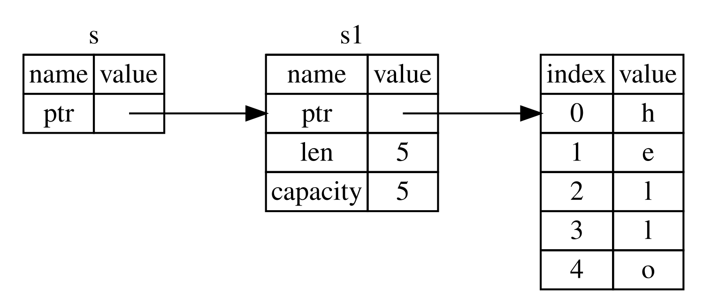

## เรเฟอเรนซ์และการยืม

ปัญหาของโค้ดทูเพิลในลิสติ้ง 4-5 คือเราต้องคืน `String` กลับไปให้ฟังก์ชันที่เรียก เพื่อให้เรายังใช้ `String` ได้หลังการเรียก `calculate_length` เพราะ `String` ถูกย้ายเข้าไปใน `calculate_length` แล้ว แต่เราสามารถส่งเรเฟอเรนซ์ (reference) ไปยังค่าของ `String` แทนได้ เรเฟอเรนซ์ก็เหมือนพอยน์เตอร์ (pointer) ตรงที่มันเป็นที่อยู่ที่เราสามารถตามไปเข้าถึงข้อมูลที่เก็บอยู่ ณ ที่อยู่นั้นได้ ข้อมูลนั้นเป็นของตัวแปรอื่น ต่างจากพอยน์เตอร์ ตรงที่เรเฟอเรนซ์ได้รับการรับประกันว่าจะชี้ไปยังค่าที่ถูกต้องของชนิดข้อมูลหนึ่งๆ ตลอดอายุของเรเฟอเรนซ์นั้น

นี่คือวิธีที่คุณจะนิยามและใช้ฟังก์ชัน `calculate_length` ที่มีเรเฟอเรนซ์ไปยังออบเจกต์เป็นพารามิเตอร์ แทนที่จะรับความเป็นเจ้าของค่า:

<Listing file-name="src/main.rs">

```rust
{{#rustdoc_include ../listings/ch04-understanding-ownership/no-listing-07-reference/src/main.rs:all}}
```

</Listing>

ประการแรก สังเกตว่าโค้ดทูเพิลทั้งหมดในส่วนการประกาศตัวแปรและค่าที่คืนกลับของฟังก์ชันหายไปแล้ว ประการที่สอง สังเกตว่าเราส่ง `&s1` เข้าไปใน `calculate_length` และในนิยามของมัน เรารับ `&String` แทนที่จะเป็น `String` เครื่องหมายแอมเพอร์แซนด์เหล่านี้แทนเรเฟอเรนซ์ และมันอนุญาตให้คุณอ้างถึงค่าบางค่าโดยไม่ต้องรับความเป็นเจ้าของค่านั้น รูปที่ 4-6 แสดงแนวคิดนี้



<span class="caption">รูปที่ 4-6: แผนภาพของ `&String` `s` ที่ชี้ไปยัง `String` `s1`</span>

> หมายเหตุ: สิ่งที่ตรงกันข้ามกับการอ้างอิงด้วย `&` คือ_การดีเรเฟอเรนซ์_ (dereferencing) ซึ่งทำได้ด้วยตัวดำเนินการดีเรเฟอเรนซ์ `*` เราจะเห็นการใช้งานตัวดำเนินการดีเรเฟอเรนซ์ในบทที่ 8 และจะพูดถึงรายละเอียดของการดีเรเฟอเรนซ์ในบทที่ 15

มาดูการเรียกฟังก์ชันตรงนี้ให้ละเอียดขึ้น:

```rust
{{#rustdoc_include ../listings/ch04-understanding-ownership/no-listing-07-reference/src/main.rs:here}}
```

วากยสัมพันธ์ `&s1` ช่วยให้เราสร้างเรเฟอเรนซ์ที่_อ้างถึง_ค่าของ `s1` แต่ไม่ได้เป็นเจ้าของมัน เพราะเรเฟอเรนซ์ไม่ได้เป็นเจ้าของมัน ค่าที่มันชี้ไปจะไม่ถูกทิ้งเมื่อเรเฟอเรนซ์นั้นเลิกถูกใช้งาน

ในทำนองเดียวกัน ซิกเนเจอร์ของฟังก์ชันใช้ `&` เพื่อบ่งชี้ว่าชนิดของพารามิเตอร์ `s` เป็นเรเฟอเรนซ์ มาเพิ่มคำอธิบายประกอบกัน:

```rust
{{#rustdoc_include ../listings/ch04-understanding-ownership/no-listing-08-reference-with-annotations/src/main.rs:here}}
```

สโคปที่ตัวแปร `s` ใช้ได้นั้นเหมือนกับสโคปของพารามิเตอร์ฟังก์ชันใดๆ แต่ค่าที่เรเฟอเรนซ์ชี้ไปจะไม่ถูกทิ้งเมื่อ `s` เลิกถูกใช้งาน เพราะ `s` ไม่ได้มีความเป็นเจ้าของ เมื่อฟังก์ชันมีเรเฟอเรนซ์เป็นพารามิเตอร์แทนที่จะเป็นค่าจริง เราจึงไม่จำเป็นต้องคืนค่าเพื่อคืนความเป็นเจ้าของ เพราะเราไม่เคยมีความเป็นเจ้าของตั้งแต่แรก

เราเรียกการกระทำของการสร้างเรเฟอเรนซ์ว่า_การยืม_ (borrowing) เช่นเดียวกับในชีวิตจริง หากใครสักคนเป็นเจ้าของบางสิ่ง คุณสามารถยืมมันจากเขาได้ เมื่อใช้เสร็จแล้ว คุณต้องคืนมัน คุณไม่ได้เป็นเจ้าของมัน

แล้วจะเกิดอะไรขึ้นหากเราพยายามแก้ไขสิ่งที่เรากำลังยืมอยู่? ลองใช้โค้ดในลิสติ้ง 4-6 กัน สปอยล์เตือนไว้ก่อน: มันใช้ไม่ได้!

<Listing number="4-6" file-name="src/main.rs" caption="พยายามแก้ไขค่าที่ถูกยืมมา">

```rust,ignore,does_not_compile
{{#rustdoc_include ../listings/ch04-understanding-ownership/listing-04-06/src/main.rs}}
```

</Listing>

นี่คือข้อผิดพลาด:

```console
{{#include ../listings/ch04-understanding-ownership/listing-04-06/output.txt}}
```

เช่นเดียวกับตัวแปรที่เป็นแบบเปลี่ยนแปลงไม่ได้โดยค่าเริ่มต้น เรเฟอเรนซ์ก็เป็นเช่นกัน เราไม่ได้รับอนุญาตให้แก้ไขสิ่งที่เรามีเรเฟอเรนซ์ไปถึง

### เรเฟอเรนซ์แบบเปลี่ยนแปลงได้

เราสามารถแก้โค้ดจากลิสติ้ง 4-6 เพื่อให้เราสามารถแก้ไขค่าที่ถูกยืมมาได้ ด้วยการปรับเล็กน้อยไม่กี่จุดที่ใช้_เรเฟอเรนซ์แบบเปลี่ยนแปลงได้_ (mutable reference) แทน:

<Listing file-name="src/main.rs">

```rust
{{#rustdoc_include ../listings/ch04-understanding-ownership/no-listing-09-fixes-listing-04-06/src/main.rs}}
```

</Listing>

ประการแรก เราเปลี่ยน `s` ให้เป็น `mut` จากนั้นเราสร้างเรเฟอเรนซ์แบบเปลี่ยนแปลงได้ด้วย `&mut s` ตรงจุดที่เราเรียกฟังก์ชัน `change` และปรับซิกเนเจอร์ของฟังก์ชันให้รับเรเฟอเรนซ์แบบเปลี่ยนแปลงได้ด้วย `some_string: &mut String` ซึ่งทำให้ชัดเจนมากว่าฟังก์ชัน `change` จะแก้ไขค่าที่มันยืมมา

เรเฟอเรนซ์แบบเปลี่ยนแปลงได้มีข้อจำกัดที่สำคัญหนึ่งข้อ: หากคุณมีเรเฟอเรนซ์แบบเปลี่ยนแปลงได้ไปยังค่าหนึ่ง คุณจะไม่มีเรเฟอเรนซ์อื่นไปยังค่านั้นได้เลย โค้ดที่พยายามสร้างเรเฟอเรนซ์แบบเปลี่ยนแปลงได้สองตัวไปยัง `s` นี้จะล้มเหลว:

<Listing file-name="src/main.rs">

```rust,ignore,does_not_compile
{{#rustdoc_include ../listings/ch04-understanding-ownership/no-listing-10-multiple-mut-not-allowed/src/main.rs:here}}
```

</Listing>

นี่คือข้อผิดพลาด:

```console
{{#include ../listings/ch04-understanding-ownership/no-listing-10-multiple-mut-not-allowed/output.txt}}
```

ข้อผิดพลาดนี้บอกว่าโค้ดนี้ไม่ถูกต้องเพราะเราไม่สามารถยืม `s` แบบเปลี่ยนแปลงได้มากกว่าหนึ่งครั้งในเวลาเดียวกัน การยืมแบบเปลี่ยนแปลงได้ครั้งแรกอยู่ใน `r1` และต้องมีอยู่จนถึงตอนที่มันถูกใช้ใน `println!` แต่ระหว่างการสร้างเรเฟอเรนซ์แบบเปลี่ยนแปลงได้ตัวนั้นกับการใช้งานของมัน เราได้พยายามสร้างเรเฟอเรนซ์แบบเปลี่ยนแปลงได้อีกตัวใน `r2` ที่ยืมข้อมูลตัวเดียวกับ `r1`

ข้อจำกัดที่ห้ามมีเรเฟอเรนซ์แบบเปลี่ยนแปลงได้หลายตัวไปยังข้อมูลเดียวกันในเวลาเดียวกันนั้นทำให้เกิดการแก้ไขค่าได้แต่ในลักษณะที่ถูกควบคุมอย่างเข้มงวด เป็นสิ่งที่ชาว Rustacean มือใหม่ต่อสู้ด้วย เพราะภาษาโปรแกรมส่วนใหญ่ให้คุณแก้ไขค่าได้เมื่อไรก็ตามที่คุณต้องการ ประโยชน์ของการมีข้อจำกัดนี้คือ Rust สามารถป้องกัน_ดาต้าเรซ_ (data race) ตอนคอมไพล์ได้ ดาต้าเรซนั้นคล้ายกับสภาวะการแข่งกัน (race condition) และเกิดขึ้นเมื่อพฤติกรรมสามอย่างนี้เกิดพร้อมกัน:

- พอยน์เตอร์สองตัวขึ้นไปเข้าถึงข้อมูลเดียวกันในเวลาเดียวกัน
- พอยน์เตอร์อย่างน้อยหนึ่งตัวถูกใช้เขียนข้อมูลนั้น
- ไม่มีกลไกใดถูกใช้เพื่อซิงโครไนซ์การเข้าถึงข้อมูลนั้น

ดาต้าเรซทำให้เกิดพฤติกรรมที่ไม่ได้นิยามไว้ (undefined behavior) และอาจวินิจฉัยและแก้ไขได้ยากเมื่อคุณพยายามตามหามันตอนรันไทม์ Rust ป้องกันปัญหานี้โดยปฏิเสธที่จะคอมไพล์โค้ดที่มีดาต้าเรซ!

เช่นเคย เราสามารถใช้วงเล็บปีกกาเพื่อสร้างสโคปใหม่ ซึ่งอนุญาตให้มีเรเฟอเรนซ์แบบเปลี่ยนแปลงได้หลายตัว แต่ต้องไม่ใช่ตัวที่อยู่_พร้อมกัน_:

```rust
{{#rustdoc_include ../listings/ch04-understanding-ownership/no-listing-11-muts-in-separate-scopes/src/main.rs:here}}
```

Rust บังคับใช้กฎที่คล้ายกันสำหรับการรวมเรเฟอเรนซ์แบบเปลี่ยนแปลงได้กับเรเฟอเรนซ์แบบเปลี่ยนแปลงไม่ได้ โค้ดนี้ทำให้เกิดข้อผิดพลาด:

```rust,ignore,does_not_compile
{{#rustdoc_include ../listings/ch04-understanding-ownership/no-listing-12-immutable-and-mutable-not-allowed/src/main.rs:here}}
```

นี่คือข้อผิดพลาด:

```console
{{#include ../listings/ch04-understanding-ownership/no-listing-12-immutable-and-mutable-not-allowed/output.txt}}
```

เฮ้อ! เรา_ก็_ไม่สามารถมีเรเฟอเรนซ์แบบเปลี่ยนแปลงได้ในขณะที่เรามีเรเฟอเรนซ์แบบเปลี่ยนแปลงไม่ได้ไปยังค่าเดียวกันได้

ผู้ใช้เรเฟอเรนซ์แบบเปลี่ยนแปลงไม่ได้ไม่คาดหวังว่าค่าจะเปลี่ยนไปต่อหน้าต่อตากะทันหัน! อย่างไรก็ตาม เรเฟอเรนซ์แบบเปลี่ยนแปลงไม่ได้หลายตัวนั้นอนุญาตได้ เพราะไม่มีใครที่เพียงแค่อ่านข้อมูลเท่านั้นที่มีความสามารถส่งผลกระทบต่อการอ่านข้อมูลของผู้อื่นได้

โปรดสังเกตว่าสโคปของเรเฟอเรนซ์เริ่มต้นจากจุดที่มันถูกนำมาใช้ และต่อเนื่องไปจนถึงครั้งสุดท้ายที่เรเฟอเรนซ์นั้นถูกใช้ ตัวอย่างเช่น โค้ดนี้จะคอมไพล์ผ่านเพราะการใช้งานครั้งสุดท้ายของเรเฟอเรนซ์แบบเปลี่ยนแปลงไม่ได้อยู่ใน `println!` ก่อนที่เรเฟอเรนซ์แบบเปลี่ยนแปลงได้จะถูกนำมาใช้:

```rust
{{#rustdoc_include ../listings/ch04-understanding-ownership/no-listing-13-reference-scope-ends/src/main.rs:here}}
```

สโคปของเรเฟอเรนซ์แบบเปลี่ยนแปลงไม่ได้ `r1` และ `r2` สิ้นสุดลงหลัง `println!` ที่พวกมันถูกใช้ครั้งสุดท้าย ซึ่งอยู่ก่อนที่เรเฟอเรนซ์แบบเปลี่ยนแปลงได้ `r3` จะถูกสร้างขึ้น สโคปเหล่านี้ไม่ทับซ้อนกัน โค้ดนี้จึงได้รับอนุญาต: คอมไพเลอร์สามารถบอกได้ว่าเรเฟอเรนซ์นั้นไม่ได้ถูกใช้งานอีกต่อไป ณ จุดหนึ่งก่อนที่สโคปจะสิ้นสุดลง

แม้ว่าข้อผิดพลาดเรื่องการยืมอาจน่าหงุดหงิดในบางครั้ง โปรดจำไว้ว่ามันคือคอมไพเลอร์ Rust ที่กำลังชี้ให้เห็นบั๊กที่อาจเกิดขึ้นได้ตั้งแต่เนิ่นๆ (ตอนคอมไพล์แทนที่จะเป็นตอนรันไทม์) และแสดงให้คุณเห็นอย่างชัดเจนว่าปัญหาอยู่ตรงไหน จากนั้นคุณก็ไม่ต้องตามหาว่าทำไมข้อมูลของคุณถึงไม่เป็นอย่างที่คุณคิด

### เรเฟอเรนซ์ที่ชี้ไปยังหน่วยความจำที่ถูกคืนแล้ว

ในภาษาที่มีพอยน์เตอร์ เป็นเรื่องง่ายที่จะสร้าง_พอยน์เตอร์ที่ชี้ไปยังหน่วยความจำที่ถูกคืนแล้ว_ (dangling pointer) ผิดพลาด โดยเป็นพอยน์เตอร์ที่อ้างถึงตำแหน่งในหน่วยความจำที่อาจถูกมอบให้คนอื่นไปแล้ว ด้วยการคืนหน่วยความจำบางส่วนในขณะที่ยังเก็บพอยน์เตอร์ไปยังหน่วยความจำนั้นไว้ ในทางตรงกันข้าม ใน Rust คอมไพเลอร์รับประกันว่าเรเฟอเรนซ์จะไม่เป็นเรเฟอเรนซ์ที่ชี้ไปยังหน่วยความจำที่ถูกคืนแล้วเด็ดขาด: หากคุณมีเรเฟอเรนซ์ไปยังข้อมูลบางส่วน คอมไพเลอร์จะทำให้แน่ใจว่าข้อมูลนั้นจะไม่ออกจากสโคปก่อนที่เรเฟอเรนซ์ไปยังข้อมูลนั้นจะออกจากสโคป

มาลองสร้างเรเฟอเรนซ์ที่ชี้ไปยังหน่วยความจำที่ถูกคืนแล้ว เพื่อดูว่า Rust ป้องกันมันอย่างไรด้วยข้อผิดพลาดตอนคอมไพล์:

<Listing file-name="src/main.rs">

```rust,ignore,does_not_compile
{{#rustdoc_include ../listings/ch04-understanding-ownership/no-listing-14-dangling-reference/src/main.rs}}
```

</Listing>

นี่คือข้อผิดพลาด:

```console
{{#include ../listings/ch04-understanding-ownership/no-listing-14-dangling-reference/output.txt}}
```

ข้อความแสดงข้อผิดพลาดนี้อ้างถึงฟีเจอร์ที่เรายังไม่ได้พูดถึง นั่นคือไลฟ์ไทม์ (lifetime) เราจะพูดถึงไลฟ์ไทม์โดยละเอียดในบทที่ 10 แต่ถ้าคุณไม่สนใจส่วนที่เกี่ยวกับไลฟ์ไทม์ ข้อความนี้ก็มีกุญแจสำคัญว่าทำไมโค้ดนี้ถึงเป็นปัญหา:

```text
this function's return type contains a borrowed value, but there is no value
for it to be borrowed from
```

มาดูให้ละเอียดขึ้นว่าเกิดอะไรขึ้นอย่างแน่ชัดในแต่ละขั้นตอนของโค้ด `dangle` ของเรา:

<Listing file-name="src/main.rs">

```rust,ignore,does_not_compile
{{#rustdoc_include ../listings/ch04-understanding-ownership/no-listing-15-dangling-reference-annotated/src/main.rs:here}}
```

</Listing>

เพราะ `s` ถูกสร้างขึ้นภายใน `dangle` เมื่อโค้ดของ `dangle` ทำงานเสร็จ `s` จะถูกคืนหน่วยความจำ แต่เราพยายามคืนเรเฟอเรนซ์ไปยังมัน นั่นหมายความว่าเรเฟอเรนซ์นี้จะชี้ไปยัง `String` ที่ไม่ถูกต้อง นั่นไม่ดีเลย! Rust จะไม่ยอมให้เราทำเช่นนี้

วิธีแก้ตรงนี้คือคืน `String` โดยตรง:

```rust
{{#rustdoc_include ../listings/ch04-understanding-ownership/no-listing-16-no-dangle/src/main.rs:here}}
```

โค้ดนี้ทำงานได้โดยไม่มีปัญหาใดๆ ความเป็นเจ้าของถูกย้ายออกไป และไม่มีอะไรถูกคืนหน่วยความจำ

### กฎของเรเฟอเรนซ์

มาสรุปสิ่งที่เราได้พูดคุยกันเกี่ยวกับเรเฟอเรนซ์:

- ในเวลาใดเวลาหนึ่ง คุณสามารถมีเรเฟอเรนซ์แบบเปลี่ยนแปลงได้หนึ่งตัว _หรือ_ เรเฟอเรนซ์แบบเปลี่ยนแปลงไม่ได้จำนวนเท่าใดก็ได้
- เรเฟอเรนซ์ต้องถูกต้องเสมอ

ต่อไป เราจะดูเรเฟอเรนซ์อีกชนิดหนึ่ง นั่นคือสไลซ์ (slice)
