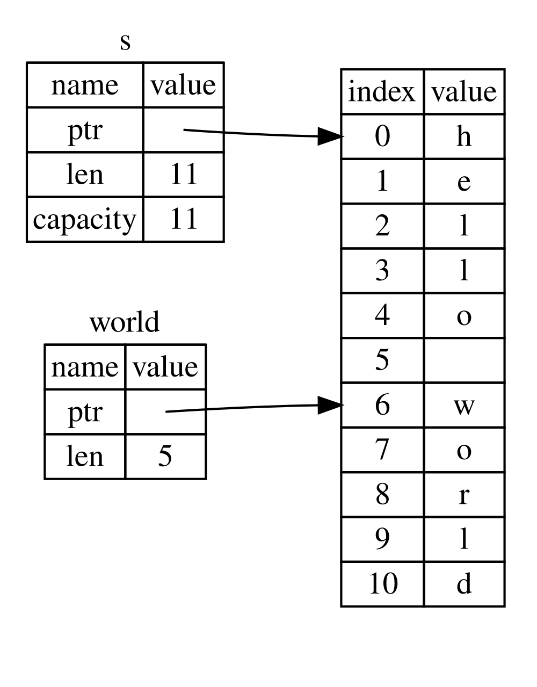

## ชนิดสไลซ์

_สไลซ์_ (slice) ช่วยให้คุณสามารถอ้างอิงถึงลำดับสมาชิกที่เรียงต่อกันใน [คอลเลกชัน (collection)](ch08-00-common-collections.md)<!-- ignore --> ได้ สไลซ์ถือเป็นการอ้างอิง (reference) ชนิดหนึ่ง จึงไม่มีความเป็นเจ้าของในตัวเอง

ลองมาดูโจทย์การเขียนโปรแกรมเล็กๆ กัน: จงเขียนฟังก์ชันที่รับสตริงของข้อความที่มีคำคั่นด้วยเว้นวรรค และคืนค่าคำแรกที่พบในสตริงนั้นออกมา หากฟังก์ชันไม่พบเว้นวรรคในสตริง ก็แสดงว่าสตริงทั้งข้อความนั้นเป็นคำเดี่ยว จึงควรส่งคืนสตริงทั้งหมดกลับมา

> หมายเหตุ: เพื่อความง่ายในการแนะนำเรื่องสไลซ์ ในหัวข้อนี้เราจะสมมติว่าข้อความประกอบด้วยอักขระแบบ ASCII เท่านั้น ส่วนรายละเอียดเรื่องการจัดการกับข้อความที่เข้ารหัสแบบ UTF-8 อย่างลึกซึ้งจะอยู่ในหัวข้อ [“การจัดเก็บข้อความที่เข้ารหัส UTF-8 ด้วยสตริง”][strings]<!-- ignore --> ในบทที่ 8

ลองมาคิดดูว่าเราจะเขียนลายเซ็น (signature) ของฟังก์ชันนี้โดยไม่ใช้สไลซ์ได้อย่างไร เพื่อให้เห็นถึงปัญหาที่สไลซ์จะเข้ามาช่วยแก้ไข:

```rust,ignore
fn first_word(s: &String) -> ?
```

ฟังก์ชัน `first_word` มีพารามิเตอร์ชนิด `&String` เนื่องจากเราไม่จำเป็นต้องยึดความเป็นเจ้าของ การเขียนแบบนี้จึงเหมาะสมอย่างยิ่ง (ในการเขียน Rust ตามสำนวนนิยม ฟังก์ชันมักจะไม่รับความเป็นเจ้าของของอาร์กิวเมนต์หากไม่จำเป็น ซึ่งเหตุผลจะยิ่งชัดเจนขึ้นเมื่อเราศึกษาลึกขึ้นเรื่อยๆ) แต่เราควรจะคืนค่าอะไรออกมาดี? เราไม่มีวิธีระบุถึง _บางส่วน_ ของสตริงได้โดยตรง อย่างไรก็ตาม เราสามารถส่งคืนค่าดัชนี (index) ของจุดสิ้นสุดคำแรก ซึ่งสังเกตได้จากตำแหน่งที่มีการเว้นวรรคออกมาได้ ลองทำแบบนั้นกัน ดังที่แสดงในลิสติ้ง 4-7

<Listing number="4-7" file-name="src/main.rs" caption="ฟังก์ชัน `first_word` ที่คืนค่าดัชนีไบต์ภายในพารามิเตอร์ `String`">

```rust
{{#rustdoc_include ../listings/ch04-understanding-ownership/listing-04-07/src/main.rs:here}}
```

</Listing>

เนื่องจากเราจำเป็นต้องตรวจสอบข้อมูลใน `String` ทีละไบต์ว่ามีตำแหน่งใดเป็นช่องว่างหรือไม่ เราจึงแปลง `String` ให้กลายเป็นอาร์เรย์ของไบต์โดยใช้เมธอด `as_bytes`:

```rust,ignore
{{#rustdoc_include ../listings/ch04-understanding-ownership/listing-04-07/src/main.rs:as_bytes}}
```

จากนั้น เราสร้างตัววนซ้ำหรืออิเทอเรเตอร์ (iterator) บนอาร์เรย์ของไบต์ด้วยเมธอด `iter`:

```rust,ignore
{{#rustdoc_include ../listings/ch04-understanding-ownership/listing-04-07/src/main.rs:iter}}
```

เราจะพูดถึงอิเทอเรเตอร์อย่างละเอียดใน [บทที่ 13][ch13]<!-- ignore --> แต่สำหรับตอนนี้ ขอให้เข้าใจว่า `iter` เป็นเมธอดที่ใช้ท่องไปทีละสมาชิกในคอลเลกชัน และเมธอด `enumerate` จะห่อหุ้มผลลัพธ์ของ `iter` เพื่อคืนค่าสมาชิกแต่ละตัวออกมาในรูปของทูเพิล (tuple) โดยสมาชิกตัวแรกของทูเพิลคือดัชนี (index) และสมาชิกตัวที่สองคือเรเฟอเรนซ์ที่ชี้ไปยังไบต์นั้น ซึ่งวิธีนี้สะดวกกว่าการที่เราต้องมาคอยคำนวณและนับดัชนีด้วยตนเอง

เนื่องจาก `enumerate` คืนค่าออกมาเป็นทูเพิล เราจึงสามารถใช้การจับคู่แพตเทิร์น (pattern) เพื่อกระจายโครงสร้าง (destructure) ของทูเพิลออกมาได้ (เราจะกล่าวถึงแพตเทิร์นเพิ่มเติมใน [บทที่ 6][ch6]<!-- ignore -->) ภายในลูป `for` เราได้ระบุแพตเทิร์น `(i, &item)` โดย `i` คือดัชนีในทูเพิล และ `&item` คือตัวข้อมูลไบต์ และเนื่องจากข้อมูลที่ได้มาจาก `.iter().enumerate()` เป็นเรเฟอเรนซ์ เราจึงใส่ `&` ไว้ในแพตเทิร์นด้วย

ภายในลูป `for` เราทำการเปรียบเทียบไบต์เพื่อค้นหาตัวอักษรช่องว่าง โดยใช้ไวยากรณ์ลิเทอรัลของไบต์ (`b' '`) หากพบช่องว่าง เราจะส่งคืนดัชนีตำแหน่งนั้นออกไปทันที แต่หากวนลูปจนจบแล้วยังไม่พบช่องว่าง เราจะส่งคืนความยาวของสตริงด้วยคำสั่ง `s.len()` แทน:

```rust,ignore
{{#rustdoc_include ../listings/ch04-understanding-ownership/listing-04-07/src/main.rs:inside_for}}
```

ตอนนี้เรามีวิธีหาดัชนีจุดสิ้นสุดของคำแรกในสตริงแล้ว แต่วิธีนี้มีจุดบกพร่องที่ร้ายแรงอยู่ ค่าที่เราส่งคืนออกมาเป็นเพียงตัวเลข `usize` โดดๆ ซึ่งตัวเลขนี้จะมีความหมายก็ต่อเมื่อนำไปใช้ร่วมกับ `&String` เดิมเท่านั้น กล่าวอีกนัยหนึ่ง เนื่องจากตัวเลขนี้แยกขาดจากตัว `String` จึงไม่มีการรับประกันใดๆ เลยว่ามันจะยังคงใช้การได้ถูกต้องต่อไปในอนาคต ลองพิจารณาโปรแกรมในลิสติ้ง 4-8 ที่เรียกใช้ฟังก์ชัน `first_word` จากลิสติ้ง 4-7:

<Listing number="4-8" file-name="src/main.rs" caption="การเก็บผลลัพธ์จากการเรียกฟังก์ชัน `first_word` แล้วเปลี่ยนเนื้อหาของ `String`">

```rust
{{#rustdoc_include ../listings/ch04-understanding-ownership/listing-04-08/src/main.rs:here}}
```

</Listing>

โปรแกรมนี้คอมไพล์ผ่านโดยไม่มีข้อผิดพลาดใดๆ และจะยังคงคอมไพล์ผ่านแม้ว่าเราจะนำตัวแปร `word` มาใช้งานต่อหลังบรรทัด `s.clear()` เนื่องจาก `word` ไม่ได้มีความผูกพันใดๆ กับสถานะของ `s` เลย ตัวแปร `word` จึงยังคงมีค่าเป็น `5` อยู่ เรายังคงสามารถนำเลข `5` นี้ไปใช้อ้างอิงกับ `s` เพื่อพยายามตัดคำแรกออกมาได้ แต่การทำเช่นนั้นจะกลายเป็นบั๊กทันที เพราะเนื้อหาใน `s` ได้ถูกลบและเปลี่ยนแปลงไปแล้วหลังจากที่เราบันทึกค่า `5` ไว้ใน `word`

การต้องคอยระมัดระวังไม่ให้ดัชนีใน `word` หลุดการซิงค์กับข้อมูลจริงใน `s` เป็นเรื่องที่ยุ่งยากและเสี่ยงต่อการเกิดข้อผิดพลาดอย่างยิ่ง! และการจัดการดัชนีเหล่านี้จะยิ่งเปราะบางและซับซ้อนขึ้นไปอีกหากเราต้องการเขียนฟังก์ชัน `second_word` เพื่อหาคำที่สอง ซึ่งลายเซ็นของฟังก์ชันจะต้องกลายเป็นแบบนี้:

```rust,ignore
fn second_word(s: &String) -> (usize, usize) {
```

ในตอนนี้เราต้องคอยติดตามทั้งดัชนีเริ่มต้น _และ_ ดัชนีสิ้นสุด ยิ่งมีค่าตัวเลขที่คำนวณมาจากข้อมูลในอดีตมากขึ้นเท่าไร แต่ไม่ได้ผูกติดกับสถานะจริงของข้อมูลเลย เราก็ยิ่งมีตัวแปรลอยๆ ที่ไม่เกี่ยวข้องกันหลายตัวที่โปรแกรมเมอร์ต้องคอยดูแลให้สอดคล้องกันเอง

โชคดีที่ Rust มีทางออกที่สมบูรณ์แบบสำหรับปัญหานี้ นั่นก็คือ **สตริงสไลซ์ (string slice)**

### สตริงสไลซ์

_สตริงสไลซ์_ (string slice) คือการอ้างอิง (reference) ไปยังช่วงข้อมูลที่ต่อเนื่องกันบางส่วนของ `String` โดยมีรูปแบบการเขียนดังนี้:

```rust
{{#rustdoc_include ../listings/ch04-understanding-ownership/no-listing-17-slice/src/main.rs:here}}
```

แทนที่จะเป็นเรเฟอเรนซ์ที่ชี้ไปยัง `String` ทั้งตัว ตัวแปร `hello` กลับเป็นเรเฟอเรนซ์ที่ชี้ไปยังบางส่วนของ `String` ตามที่ระบุไว้ในส่วนของเรนจ์ `[0..5]` เราสร้างสไลซ์ขึ้นมาโดยใช้ช่วงของดัชนีภายในวงเล็บเหลี่ยมในรูปแบบ `[starting_index..ending_index]` โดย _`starting_index`_ คือดัชนีตำแหน่งแรกของสไลซ์ และ _`ending_index`_ คือตำแหน่งที่มากกว่าตำแหน่งสุดท้ายในสไลซ์อยู่หนึ่ง (ไม่นับรวมตัวท้าย) ในระดับโครงสร้างภายใน ข้อมูลของสไลซ์จะจัดเก็บพอยน์เตอร์ที่ชี้ไปยังตำแหน่งเริ่มต้น และความยาวของสไลซ์ ซึ่งมีค่าเท่ากับ _`ending_index`_ ลบด้วย _`starting_index`_ ดังนั้นในกรณีของ `let world = &s[6..11];` ตัวแปร `world` จะเป็นสไลซ์ที่เก็บพอยน์เตอร์ชี้ไปยังไบต์ที่ดัชนี 6 ของ `s` และมีความยาวเท่ากับ `5`

รูปที่ 4-7 แสดงแผนภาพโครงสร้างในหน่วยความจำของสตริงสไลซ์



<span class="caption">รูปที่ 4-7: สตริงสไลซ์ที่อ้างถึงบางส่วนของ `String`</span>

ด้วยไวยากรณ์เรนจ์ `..` ของ Rust หากคุณต้องการเริ่มต้นสไลซ์ที่ดัชนี 0 คุณสามารถละเว้นตัวเลขที่อยู่หน้าจุดสองจุดได้ กล่าวคือ โค้ดสองบรรทัดนี้ทำงานเทียบเท่ากันทุกประการ:

```rust
let s = String::from("hello");

let slice = &s[0..2];
let slice = &s[..2];
```

ในทำนองเดียวกัน หากสไลซ์ของคุณครอบคลุมไปจนถึงไบต์สุดท้ายของ `String` คุณก็สามารถละเว้นตัวเลขตัวหลังได้เช่นกัน นั่นหมายความว่าโค้ดเหล่านี้ให้ผลลัพธ์เหมือนกัน:

```rust
let s = String::from("hello");

let len = s.len();

let slice = &s[3..len];
let slice = &s[3..];
```

นอกจากนี้ คุณยังสามารถละเว้นตัวเลขทั้งสองตัวเพื่อสร้างสไลซ์ที่ครอบคลุมเนื้อหาของสตริงทั้งหมดได้ด้วย:

```rust
let s = String::from("hello");

let len = s.len();

let slice = &s[0..len];
let slice = &s[..];
```

> หมายเหตุ: ดัชนีช่วงของสตริงสไลซ์จะต้องอยู่บนขอบเขตของอักขระ UTF-8 ที่ถูกต้องเสมอ หากคุณพยายามตัดสไลซ์ตรงกึ่งกลางของไบต์ที่ประกอบกันเป็นอักขระแบบหลายไบต์ โปรแกรมของคุณจะเกิดข้อผิดพลาดและแพนิกทันที

เมื่อเข้าใจหลักการแล้ว เราลองมาเขียนฟังก์ชัน `first_word` ใหม่โดยเปลี่ยนมาคืนค่าเป็นสไลซ์กัน ชนิดข้อมูลที่แทน “สตริงสไลซ์” จะเขียนว่า `&str`:

<Listing file-name="src/main.rs">

```rust
{{#rustdoc_include ../listings/ch04-understanding-ownership/no-listing-18-first-word-slice/src/main.rs:here}}
```

</Listing>

เราหาดัชนีจุดสิ้นสุดของคำด้วยวิธีเดียวกับในลิสติ้ง 4-7 นั่นคือมองหาช่องว่างแรกที่พบ และเมื่อพบช่องว่าง เราจะส่งคืนสตริงสไลซ์โดยกำหนดจุดเริ่มต้นของสตริงและดัชนีของช่องว่างเป็นจุดเริ่มต้นและจุดสิ้นสุดของสไลซ์ตามลำดับ

ตอนนี้เมื่อเราเรียกใช้ `first_word` เราจะได้ค่าเดี่ยวๆ ที่ผูกติดอยู่กับข้อมูลสตริงต้นฉบับเบื้องหลังเสมอ ค่านี้ประกอบด้วยเรเฟอเรนซ์ที่ชี้ไปยังจุดเริ่มต้นของสไลซ์และจำนวนสมาชิกในสไลซ์นั้น

การคืนค่าเป็นสไลซ์ยังนำไปใช้กับฟังก์ชันอย่าง `second_word` ได้อย่างสวยงามเช่นกัน:

```rust,ignore
fn second_word(s: &String) -> &str {
```

ในตอนนี้เราได้ API ที่ตรงไปตรงมาและปลอดภัยกว่าเดิมมาก เพราะคอมไพเลอร์ของ Rust จะช่วยรับประกันว่าเรเฟอเรนซ์ที่ชี้เข้าไปใน `String` จะยังคงถูกต้องสมบูรณ์อยู่เสมอ จำบั๊กในลิสติ้ง 4-8 ได้หรือไม่ ที่เราหาดัชนีของคำแรกได้แล้ว แต่หลังจากนั้นกลับไปล้างข้อมูลในสตริงทิ้งจนทำให้ดัชนีไม่ถูกต้อง? โค้ดชุดนั้นมีข้อผิดพลาดทางตรรกะแต่กลับไม่แสดงข้อผิดพลาดใดๆ ให้เห็นในทันที ซึ่งปัญหาจะไปโผล่ขึ้นในภายหลังเมื่อเราพยายามนำดัชนีไปใช้งานกับสตริงที่ว่างเปล่าไปแล้ว แต่การใช้สไลซ์จะทำให้บั๊กในลักษณะนี้ไม่สามารถเกิดขึ้นได้เลย และช่วยให้เราตรวจพบปัญหาในโค้ดได้ตั้งแต่เนิ่นๆ เพราะหากเรานำ `first_word` เวอร์ชันที่ใช้สไลซ์ไปใช้งาน คอมไพเลอร์จะตรวจจับและแจ้งข้อผิดพลาดทันทีตั้งแต่ตอนคอมไพล์:

<Listing file-name="src/main.rs">

```rust,ignore,does_not_compile
{{#rustdoc_include ../listings/ch04-understanding-ownership/no-listing-19-slice-error/src/main.rs:here}}
```

</Listing>

นี่คือข้อความแจ้งเตือนจากคอมไพเลอร์:

```console
{{#include ../listings/ch04-understanding-ownership/no-listing-19-slice-error/output.txt}}
```

ขอให้ย้อนนึกถึงกฎของการยืม: หากเรามีเรเฟอเรนซ์แบบเปลี่ยนแปลงไม่ได้ไปยังข้อมูลใดอยู่ เราจะไม่สามารถสร้างเรเฟอเรนซ์แบบเปลี่ยนแปลงได้ไปยังข้อมูลนั้นได้อีก และเนื่องจากเมธอด `clear` จำเป็นต้องตัดทอนและล้างข้อมูลใน `String` มันจึงต้องขอยืมเรเฟอเรนซ์แบบเปลี่ยนแปลงได้ แต่คำสั่ง `println!` ที่อยู่ถัดมายังคงต้องใช้งานเรเฟอเรนซ์ใน `word` อยู่ ทำให้เรเฟอเรนซ์แบบเปลี่ยนแปลงไม่ได้ยังคงต้องมีผลใช้งานอยู่ ณ จุดนั้น Rust จึงไม่อนุญาตให้เรเฟอเรนซ์แบบเปลี่ยนแปลงได้จาก `clear` กับเรเฟอเรนซ์แบบเปลี่ยนแปลงไม่ได้ใน `word` คงอยู่พร้อมกันได้ ส่งผลให้การคอมไพล์ไม่ผ่าน การทำเช่นนี้ไม่เพียงแต่ทำให้ API ของเราใช้งานง่ายขึ้นเท่านั้น แต่ยังช่วยกำจัดกลุ่มข้อผิดพลาดประเภทนี้ทิ้งไปอย่างสิ้นเชิงตั้งแต่ตอนคอมไพล์!

<!-- Old headings. Do not remove or links may break. -->

<a id="string-literals-are-slices"></a>

#### สตริงลิเทอรัลในฐานะสไลซ์

จำได้ไหมว่าเราเคยกล่าวไว้ว่า สตริงลิเทอรัลจะถูกฝังและจัดเก็บไว้ภายในไฟล์ไบนารีที่รันได้ เมื่อเราได้เรียนรู้เรื่องสไลซ์แล้ว เราจึงสามารถเข้าใจธรรมชาติที่แท้จริงของสตริงลิเทอรัลได้อย่างถ่องแท้:

```rust
let s = "Hello, world!";
```

ชนิดข้อมูลของ `s` ในบรรทัดนี้ก็คือ `&str` นั่นเอง: มันคือสไลซ์ที่ชี้ไปยังตำแหน่งของข้อความที่ถูกฝังไว้ในไฟล์ไบนารี และนี่ก็คือเหตุผลว่าทำไมสตริงลิเทอรัลจึงไม่สามารถแก้ไขเปลี่ยนแปลงค่าได้ เพราะ `&str` คือเรเฟอเรนซ์แบบเปลี่ยนแปลงไม่ได้

#### สตริงสไลซ์ในฐานะพารามิเตอร์

การที่เรารู้ว่าสามารถสร้างสไลซ์ขึ้นมาจากทั้งสตริงลิเทอรัลและค่าของ `String` ได้ นำไปสู่การปรับปรุงฟังก์ชัน `first_word` ให้ดียิ่งขึ้นไปอีกขั้น โดยเริ่มจากลายเซ็นของฟังก์ชัน:

```rust,ignore
fn first_word(s: &String) -> &str {
```

โปรแกรมเมอร์ Rust ที่มีประสบการณ์จะนิยมเขียนลายเซ็นของฟังก์ชันตามที่แสดงในลิสติ้ง 4-9 แทน เพราะมันเปิดโอกาสให้เราสามารถเรียกใช้ฟังก์ชันเดียวกันนี้กับทั้งค่าชนิด `&String` และค่าชนิด `&str` ได้อย่างสะดวก:

<Listing number="4-9" caption="ปรับปรุงฟังก์ชัน `first_word` โดยใช้สตริงสไลซ์เป็นชนิดของพารามิเตอร์ `s`">

```rust,ignore
{{#rustdoc_include ../listings/ch04-understanding-ownership/listing-04-09/src/main.rs:here}}
```

</Listing>

หากเรามีสตริงสไลซ์ เราสามารถส่งมันเข้าไปในฟังก์ชันได้โดยตรง และหากเรามี `String` เราก็สามารถส่งสไลซ์ของ `String` นั้นหรือส่งเรเฟอเรนซ์ไปยัง `String` เข้าไปได้เลย ความยืดหยุ่นที่ยอดเยี่ยมนี้อาศัยประโยชน์จากคุณสมบัติ _การบังคับดีเรฟ (deref coercion)_ ซึ่งเป็นฟีเจอร์ที่เราจะได้เรียนรู้ในหัวข้อ [“การใช้การบังคับดีเรฟในฟังก์ชันและเมธอด”][deref-coercions]<!-- ignore --> ในบทที่ 15

การนิยามฟังก์ชันให้รับสตริงสไลซ์แทนที่จะรับเรเฟอเรนซ์ไปยัง `String` จะช่วยให้ API ของเรามีความเป็นสากลและนำไปใช้งานได้หลากหลายขึ้นอย่างมาก โดยไม่สูญเสียความสามารถใดๆ ไปเลย:

<Listing file-name="src/main.rs">

```rust
{{#rustdoc_include ../listings/ch04-understanding-ownership/listing-04-09/src/main.rs:usage}}
```

</Listing>

### สไลซ์แบบอื่นๆ

สตริงสไลซ์ถูกออกแบบมาสำหรับข้อความโดยเฉพาะ แต่ใน Rust ยังมีชนิดของสไลซ์แบบทั่วไปสำหรับคอลเลกชันอื่นๆ ด้วย ลองพิจารณาอาร์เรย์ต่อไปนี้:

```rust
let a = [1, 2, 3, 4, 5];
```

เช่นเดียวกับที่เราต้องการอ้างถึงบางส่วนของสตริง เราก็อาจต้องการอ้างถึงบางส่วนของอาร์เรย์ได้เช่นกัน ซึ่งเราสามารถเขียนได้ดังนี้:

```rust
let a = [1, 2, 3, 4, 5];

let slice = &a[1..3];

assert_eq!(slice, &[2, 3]);
```

สไลซ์นี้มีชนิดข้อมูลเป็น `&[i32]` โดยมีหลักการทำงานแบบเดียวกับสตริงสไลซ์ทุกประการ นั่นคือการเก็บเรเฟอเรนซ์ที่ชี้ไปยังสมาชิกตัวแรกควบคู่กับความยาวของสไลซ์ คุณสามารถใช้สไลซ์ประเภทนี้กับคอลเลกชันรูปแบบอื่นๆ ได้อย่างหลากหลาย ซึ่งเราจะพูดถึงคอลเลกชันเหล่านี้อย่างละเอียดเมื่อเราศึกษาเรื่องเวกเตอร์ (vector) ในบทที่ 8

## สรุป

แนวคิดของระบบความเป็นเจ้าของ (ownership), การยืมข้อมูล (borrowing), และสไลซ์ (slice) ล้วนทำงานร่วมกันเพื่อรับประกันความปลอดภัยของหน่วยความจำในโปรแกรม Rust ตั้งแต่ตอนคอมไพล์ โดยภาษา Rust มอบอำนาจในการควบคุมการใช้งานหน่วยความจำให้คุณได้อย่างเต็มที่เช่นเดียวกับภาษาโปรแกรมระดับระบบอื่นๆ แต่การที่ตัวแปรที่เป็นเจ้าของจะทำหน้าที่คืนและล้างหน่วยความจำให้อัตโนมัติเมื่อหลุดออกจากขอบเขต หมายความว่าคุณไม่จำเป็นต้องคอยเขียนคำสั่งจัดการหน่วยความจำและไม่ต้องเสียเวลาดีบักปัญหาเหล่านี้ด้วยตนเองอีกต่อไป

ระบบความเป็นเจ้าของส่งผลต่อการออกแบบและการทำงานขององค์ประกอบอื่นๆ เกือบทั้งหมดใน Rust ดังนั้นเราจึงจะพบเห็นและต่อยอดแนวคิดเหล่านี้อย่างต่อเนื่องตลอดทั้งเล่ม และในบทที่ 5 เราจะไปศึกษาการจัดกลุ่มข้อมูลที่เกี่ยวข้องกันเข้าด้วยกันผ่านโครงสร้างข้อมูลที่เรียกว่า `struct`

[ch13]: ch13-02-iterators.html
[ch6]: ch06-02-match.html#แพตเทิรนทีผูกกับคา
[strings]: ch08-02-strings.html#เกบขอความทีเขารหัส-utf-8-ดวยสตริง
[deref-coercions]: ch15-02-deref.html#using-deref-coercions-in-functions-and-methods
