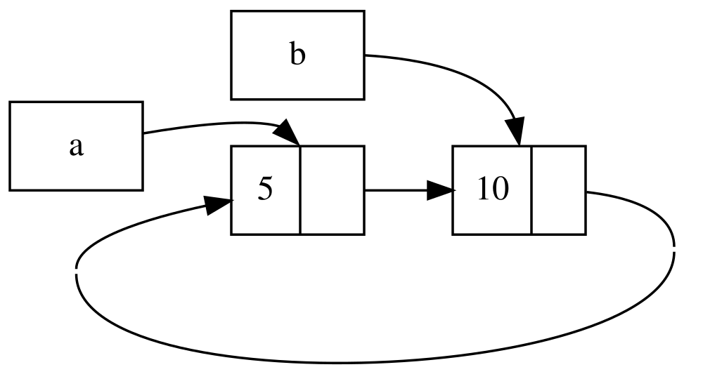

## วงจรเรเฟอเรนซ์ทำให้หน่วยความจำรั่วไหลได้

การรับประกันความปลอดภัยของหน่วยความจำใน Rust ทำให้การเผลอสร้างหน่วยความจำที่ไม่มีวันถูกคืนหรือเก็บกวาดเลย (ซึ่งเรียกว่า _หน่วยความจำรั่วไหล (memory leak)_) เป็นเรื่องที่เกิดขึ้นได้ยาก แต่ก็ไม่ได้เป็นไปไม่ได้เลยเสียทีเดียว การป้องกันไม่ให้เกิดหน่วยความจำรั่วไหลอย่างสมบูรณ์ 100% ไม่ได้เป็นหนึ่งในการรับประกันของ Rust ซึ่งหมายความว่าในมุมมองของ Rust แล้ว การเกิดหน่วยความจำรั่วไหลยังถือว่าปลอดภัยต่อหน่วยความจำ (memory safe) เราสามารถเห็นได้ว่า Rust ยอมให้เกิดหน่วยความจำรั่วไหลได้เมื่อมีการใช้ `Rc<T>` ร่วมกับ `RefCell<T>`: โดยเราสามารถสร้างการอ้างอิงที่ไอเท็มต่าง ๆ อ้างถึงกันและกันเป็นวงรอบ หรือที่เรียกว่า _วงรอบการอ้างอิง (reference cycle)_ สิ่งนี้ทำให้เกิดหน่วยความจำรั่วไหล เพราะตัวนับจำนวนการอ้างอิงของแต่ละไอเท็มในวงรอบจะไม่มีวันลดลงจนเหลือ 0 และค่าเหล่านั้นก็จะไม่ถูกทิ้ง (drop) หรือคืนหน่วยความจำเลย

### การสร้างวงจรเรเฟอเรนซ์

มาดูว่าวงรอบการอ้างอิงเกิดขึ้นได้อย่างไรและเราจะป้องกันมันได้อย่างไร โดยเริ่มจากนิยามของ enum `List` และเมธอด `tail` ในลิสติ้ง 15-25

<Listing number="15-25" file-name="src/main.rs" caption="นิยาม cons list ที่ถือ `RefCell<T>` เพื่อให้เราแก้ไขสิ่งที่วาเรียนต์ `Cons` กำลังอ้างถึงได้">

```rust
{{#rustdoc_include ../listings/ch15-smart-pointers/listing-15-25/src/main.rs:here}}
```

</Listing>

เรานำรูปแบบนิยามของ `List` จากลิสติ้ง 15-5 มาปรับเปลี่ยนอีกครั้ง โดยสมาชิกตัวที่สองในวาเรียนต์ `Cons` ตอนนี้กลายเป็น `RefCell<Rc<List>>` ซึ่งหมายความว่าแทนที่เราจะแก้ไขค่าตัวเลข `i32` เหมือนในลิสติ้ง 15-24 เรากลับต้องการแก้ไขค่า `List` ที่วาเรียนต์ `Cons` กำลังชี้อยู่แทน นอกจากนี้เรายังเพิ่มเมธอด `tail` เข้ามา เพื่ออำนวยความสะดวกในการเข้าถึงสมาชิกตัวที่สองเมื่อเราถือครองวาเรียนต์ `Cons`

ในลิสติ้ง 15-26 เราได้เพิ่มฟังก์ชัน `main` ที่นำนิยามในลิสติ้ง 15-25 มาใช้งาน โค้ดนี้สร้างลิสต์ใน `a` และลิสต์ใน `b` ที่ชี้ไปยังลิสต์ใน `a` จากนั้นจึงแก้ไขลิสต์ใน `a` ให้ชี้วนกลับมายัง `b` ซึ่งทำให้เกิดวงรอบการอ้างอิงขึ้น และระหว่างทางจะมีคำสั่ง `println!` เพื่อแสดงตัวเลขนับการอ้างอิง ณ แต่ละขั้นตอนของกระบวนการนี้

<Listing number="15-26" file-name="src/main.rs" caption="การสร้างวงจรเรเฟอเรนซ์ของค่า `List` สองค่าที่ชี้ไปยังกันและกัน">

```rust
{{#rustdoc_include ../listings/ch15-smart-pointers/listing-15-26/src/main.rs:here}}
```

</Listing>

เราสร้างอินสแตนซ์ของ `Rc<List>` ที่เก็บค่า `List` ไว้ในตัวแปร `a` โดยเริ่มต้นเป็นลิสต์ `5, Nil` จากนั้นเราสร้างอินสแตนซ์ `Rc<List>` ที่เก็บค่า `List` อีกชุดหนึ่งไว้ในตัวแปร `b` ซึ่งเก็บค่า `10` และชี้ไปยังลิสต์ใน `a`

จากนั้นเราแก้ไขค่าใน `a` ให้ชี้ไปยัง `b` แทนที่จะเป็น `Nil` ซึ่งทำให้เกิดวงรอบขึ้นมา โดยเราเรียกใช้เมธอด `tail` เพื่อขอเรเฟอเรนซ์ที่ชี้ไปยัง `RefCell<Rc<List>>` ใน `a` แล้วเก็บไว้ในตัวแปร `link` จากนั้นจึงใช้เมธอด `borrow_mut` บน `RefCell<Rc<List>>` นั้น เพื่อเปลี่ยนค่าภายในจาก `Rc<List>` ที่เคยเก็บ `Nil` ให้กลายมาเป็น `Rc<List>` ใน `b`

เมื่อเรารันโค้ดนี้ โดยคอมเมนต์คำสั่ง `println!` บรรทัดสุดท้ายเอาไว้ก่อนชั่วคราว เราจะได้ผลลัพธ์ดังนี้:

```console
{{#include ../listings/ch15-smart-pointers/listing-15-26/output.txt}}
```

จำนวนการอ้างอิงของอินสแตนซ์ `Rc<List>` ทั้งใน `a` และ `b` จะกลายเป็น 2 หลังจากที่เราเปลี่ยนลิสต์ใน `a` ให้ชี้ไปยัง `b` และเมื่อสิ้นสุดฟังก์ชัน `main` ทาง Rust จะทิ้งตัวแปร `b` ซึ่งจะลดจำนวนการอ้างอิงของอินสแตนซ์ `Rc<List>` ของ `b` จาก 2 เหลือ 1 หน่วยความจำที่ `Rc<List>` นี้ถือครองอยู่บนฮีปจะไม่ถูกคืน ณ จุดนี้ เนื่องจากจำนวนการอ้างอิงยังเป็น 1 ไม่ใช่ 0 จากนั้น Rust ก็จะทิ้งตัวแปร `a` ซึ่งลดจำนวนการอ้างอิงของ `Rc<List>` ของ `a` จาก 2 เหลือ 1 เช่นกัน หน่วยความจำของอินสแตนซ์นี้ก็ไม่สามารถถูกคืนได้เช่นกัน เพราะอินสแตนซ์ `Rc<List>` อีกตัวยังคงอ้างอิงถึงมันอยู่ ส่งผลให้หน่วยความจำที่จัดสรรไว้ให้กับลิสต์นี้จะตกค้างอยู่ตลอดไปโดยไม่มีวันถูกเรียกคืน เพื่อให้เห็นภาพวงรอบการอ้างอิงนี้ได้ชัดเจนยิ่งขึ้น เราได้วาดแผนภาพแสดงไว้ในรูปที่ 15-4



<span class="caption">รูปที่ 15-4: วงจรเรเฟอเรนซ์ของลิสต์ `a` และ `b` ที่ชี้ไปยังกันและกัน</span>

หากคุณยกเลิกการคอมเมนต์คำสั่ง `println!` บรรทัดสุดท้ายออกแล้วรันโปรแกรมดู Rust จะพยายามพิมพ์ค่าในวงรอบนี้วนซ้ำไปเรื่อย ๆ โดย `a` ชี้ไปยัง `b` และ `b` ชี้วนกลับมายัง `a` จนกระทั่งหน่วยความจำสแตกเต็มและเกิดสแตกโอเวอร์โฟลว์ (stack overflow)

เมื่อเทียบกับโปรแกรมที่ใช้งานจริง ผลกระทบของการสร้างวงรอบการอ้างอิงในตัวอย่างนี้อาจดูไม่ร้ายแรงนัก เพราะทันทีที่เราสร้างวงรอบการอ้างอิงเสร็จสิ้น โปรแกรมก็จบการทำงานลงทันที อย่างไรก็ตาม หากเป็นโปรแกรมขนาดใหญ่และซับซ้อนที่มีการจัดสรรหน่วยความจำปริมาณมากเป็นวงรอบและถือครองค้างไว้เป็นเวลานาน โปรแกรมก็จะกินพื้นที่หน่วยความจำมากเกินความจำเป็น และอาจทำให้ระบบทำงานหนักจนหน่วยความจำหมดลงได้

การสร้างวงรอบการอ้างอิงนั้นไม่ใช่เรื่องที่จะเกิดขึ้นได้ง่าย ๆ แต่ก็ไม่ใช่ว่าจะเป็นไปไม่ได้ หากคุณมีค่า `RefCell<T>` ที่เก็บค่า `Rc<T>` ไว้ข้างใน หรือโครงสร้างข้อมูลที่มีการซ้อนทับกันระหว่างความสามารถในการเปลี่ยนแปลงค่าภายใน (interior mutability) กับการนับจำนวนการอ้างอิง (reference counting) ในลักษณะนี้ คุณจะต้องตรวจสอบให้รอบคอบว่าไม่ได้เผลอสร้างวงรอบขึ้นมา เพราะคุณไม่สามารถพึ่งพาให้ Rust ตรวจจับสิ่งนี้ให้ได้ การเกิดวงรอบการอ้างอิงถือเป็นข้อผิดพลาดเชิงตรรกะ (logic bug) ในโปรแกรมของคุณ ซึ่งคุณควรใช้การทดสอบแบบอัตโนมัติ (automated tests), การตรวจทานโค้ด (code review) และแนวปฏิบัติด้านวิศวกรรมซอฟต์แวร์อื่น ๆ เข้ามาช่วยลดความเสี่ยงให้เหลือน้อยที่สุด

อีกแนวทางหนึ่งในการหลีกเลี่ยงวงรอบการอ้างอิงคือ การจัดโครงสร้างข้อมูลใหม่เพื่อให้การอ้างอิงบางส่วนแสดงถึงสิทธิ์ความเป็นเจ้าของ ในขณะที่การอ้างอิงบางส่วนไม่แสดงความเป็นเจ้าของ ผลลัพธ์ก็คือ คุณสามารถมีวงรอบที่ประกอบด้วยความสัมพันธ์แบบเป็นเจ้าของร่วมกับความสัมพันธ์แบบไม่เป็นเจ้าของได้ โดยจะมีเพียงความสัมพันธ์แบบเป็นเจ้าของเท่านั้นที่ส่งผลต่อการคืนหน่วยความจำและการทิ้งค่า ในลิสติ้ง 15-25 เราต้องการให้วาเรียนต์ `Cons` เป็นเจ้าของลิสต์ของมันเสมอ การจัดโครงสร้างใหม่ในลักษณะนั้นจึงทำไม่ได้ในตัวอย่าง cons list แต่เราลองมาดูตัวอย่างโครงสร้างข้อมูลแบบกราฟที่ประกอบด้วยโหนดแม่และโหนดลูก เพื่อดูว่าความสัมพันธ์แบบไม่เป็นเจ้าของสามารถนำมาใช้ป้องกันวงรอบการอ้างอิงได้อย่างไร

<!-- Old headings. Do not remove or links may break. -->

<a id="preventing-reference-cycles-turning-an-rct-into-a-weakt"></a>

### การป้องกันวงจรเรเฟอเรนซ์ด้วย `Weak<T>`

จนถึงตอนนี้ เราได้เห็นแล้วว่าการเรียก `Rc::clone` จะเพิ่มค่า `strong_count` ของอินสแตนซ์ `Rc<T>` และอินสแตนซ์ของ `Rc<T>` จะถูกคืนหน่วยความจำและเก็บกวาดก็ต่อเมื่อ `strong_count` ของมันลดลงเหลือ 0 เท่านั้น นอกจากนี้ คุณยังสามารถสร้างการอ้างอิงแบบอ่อน หรือ _เรเฟอเรนซ์แบบวีค (weak reference)_ ไปยังค่าที่อยู่ภายในอินสแตนซ์ `Rc<T>` ได้ด้วยการเรียกใช้ฟังก์ชัน `Rc::downgrade` โดยส่งเรเฟอเรนซ์ของ `Rc<T>` เข้าไป ทั้งนี้ _เรเฟอเรนซ์แบบสตรอง (strong reference)_ คือวิธีที่คุณใช้แชร์สิทธิ์ความเป็นเจ้าของในอินสแตนซ์ `Rc<T>` ในขณะที่ _เรเฟอเรนซ์แบบวีค_ จะไม่ได้แสดงถึงความสัมพันธ์เชิงความเป็นเจ้าของ และจำนวนของมันจะไม่ส่งผลต่อจังหวะเวลาที่อินสแตนซ์ `Rc<T>` จะถูกเก็บกวาดเลยแม้แต่น้อย เรเฟอเรนซ์แบบวีคจึงไม่มีทางทำให้เกิดวงรอบการอ้างอิง เพราะวงรอบใดก็ตามที่เกี่ยวข้องกับเรเฟอเรนซ์แบบวีคจะถูกตัดขาดลงทันทีเมื่อจำนวนเรเฟอเรนซ์แบบสตรองของค่าที่เกี่ยวข้องกลายเป็น 0

เมื่อคุณเรียก `Rc::downgrade` คุณจะได้รับสมาร์ตพอยน์เตอร์ชนิด `Weak<T>` ออกมา โดยแทนที่จะเป็นการเพิ่ม `strong_count` ขึ้น 1 การเรียก `Rc::downgrade` จะไปเพิ่มค่า `weak_count` ขึ้น 1 แทน ชนิดข้อมูล `Rc<T>` จะใช้ `weak_count` ในการคอยติดตามว่ามีเรเฟอเรนซ์ `Weak<T>` หลงเหลืออยู่กี่ตัว เช่นเดียวกับ `strong_count` เพียงแต่จุดต่างคือ `weak_count` ไม่จำเป็นต้องลดลงเหลือ 0 ก็สามารถเก็บกวาดอินสแตนซ์ `Rc<T>` ได้

และเนื่องจากค่าที่ `Weak<T>` อ้างอิงถึงอาจจะถูกทิ้งและคืนหน่วยความจำไปแล้ว ดังนั้นก่อนที่จะทำสิ่งใดกับค่าที่ `Weak<T>` กำลังชี้อยู่ คุณจะต้องตรวจสอบให้แน่ใจก่อนว่าค่านั้นยังมีอยู่จริง โดยทำได้ผ่านการเรียกเมธอด `upgrade` บนอินสแตนซ์ของ `Weak<T>` ซึ่งจะส่งคืนค่าเป็น `Option<Rc<T>>` คุณจะได้ผลลัพธ์เป็น `Some` หากค่า `Rc<T>` นั้นยังไม่ถูกทิ้ง และจะได้ผลลัพธ์เป็น `None` หากค่า `Rc<T>` ถูกทิ้งไปเรียบร้อยแล้ว และเนื่องจากเมธอด `upgrade` คืนค่าเป็น `Option<Rc<T>>` ทาง Rust จึงรับประกันว่าทั้งกรณี `Some` และ `None` จะได้รับการจัดการอย่างถูกต้องเสมอ และจะไม่มีทางเกิดพอยน์เตอร์ที่ไม่ถูกต้องหรือชี้ไปที่ความว่างเปล่า (dangling pointer) อย่างแน่นอน

เพื่อเป็นตัวอย่าง แทนที่จะใช้ลิสต์ที่แต่ละสมาชิกรับรู้เพียงสมาชิกตัวถัดไปเท่านั้น เราจะมาสร้างโครงสร้างข้อมูลแบบทรี (tree) ที่สมาชิกแต่ละตัวรับรู้ทั้งสมาชิกที่เป็นโหนดลูก (children) _และ_ สมาชิกที่เป็นโหนดแม่ (parent) ของมัน

<!-- Old headings. Do not remove or links may break. -->

<a id="creating-a-tree-data-structure-a-node-with-child-nodes"></a>

#### การสร้างโครงสร้างข้อมูลแบบทรี

เริ่มต้นด้วย เราจะสร้างทรีที่มีโหนด (node) ซึ่งรู้จักโหนดลูกของมัน เราจะสร้าง struct ชื่อ `Node` ที่ถือค่า `i32` ของตัวเองรวมทั้งเรเฟอเรนซ์ไปยังค่า `Node` ที่เป็นโหนดลูกของมัน:

<span class="filename">ชื่อไฟล์: src/main.rs</span>

```rust
{{#rustdoc_include ../listings/ch15-smart-pointers/listing-15-27/src/main.rs:here}}
```

เราต้องการให้ `Node` เป็นเจ้าของโหนดลูกของมัน และเราต้องการแชร์ความเป็นเจ้าของนั้นกับตัวแปร เพื่อให้เราเข้าถึงแต่ละ `Node` ในทรีได้โดยตรง ในการทำเช่นนี้ เรากำหนดให้สมาชิกของ `Vec<T>` เป็นค่าชนิด `Rc<Node>` เรายังต้องการแก้ไขว่าโหนดใดเป็นโหนดลูกของโหนดอื่น ดังนั้นเราจึงมี `RefCell<T>` อยู่ใน `children` ครอบ `Vec<Rc<Node>>`

ต่อไป เราจะใช้นิยาม struct ของเราและสร้างอินสแตนซ์ `Node` หนึ่งตัวชื่อ `leaf` ที่มีค่า `3` และไม่มีโหนดลูก และอีกอินสแตนซ์หนึ่งชื่อ `branch` ที่มีค่า `5` และมี `leaf` เป็นหนึ่งในโหนดลูกของมัน ดังที่แสดงในลิสติ้ง 15-27

<Listing number="15-27" file-name="src/main.rs" caption="การสร้างโหนด `leaf` ที่ไม่มีโหนดลูกและโหนด `branch` ที่มี `leaf` เป็นหนึ่งในโหนดลูกของมัน">

```rust
{{#rustdoc_include ../listings/ch15-smart-pointers/listing-15-27/src/main.rs:there}}
```

</Listing>

เราโคลน `Rc<Node>` ใน `leaf` และเก็บมันไว้ใน `branch` หมายความว่า `Node` ใน `leaf` ตอนนี้มีเจ้าของสองราย: `leaf` และ `branch` เราสามารถไปจาก `branch` ถึง `leaf` ผ่าน `branch.children` ได้ แต่ไม่มีทางที่จะไปจาก `leaf` ถึง `branch` ได้ เหตุผลคือ `leaf` ไม่มีเรเฟอเรนซ์ไปยัง `branch` และไม่รู้ว่าพวกมันเกี่ยวข้องกัน เราต้องการให้ `leaf` รู้ว่า `branch` เป็นโหนดแม่ของมัน เราจะทำเช่นนั้นต่อไป

#### การเพิ่มเรเฟอเรนซ์จากโหนดลูกไปยังโหนดแม่

เพื่อให้โหนดลูกรับรู้ถึงโหนดแม่ของมัน เราจำเป็นต้องเพิ่มฟิลด์ `parent` เข้าไปในนิยามของ struct `Node` แต่ปัญหาอยู่ที่การตัดสินใจว่าชนิดข้อมูลของ `parent` ควรเป็นชนิดใด เรารู้ว่ามันไม่สามารถเก็บ `Rc<T>` ได้ เพราะนั่นจะสร้างวงรอบการอ้างอิงขึ้นมา โดย `leaf.parent` ชี้ไปยัง `branch` และ `branch.children` ชี้ไปยัง `leaf` ซึ่งจะส่งผลให้ค่า `strong_count` ของพวกมันไม่มีวันลดลงเหลือ 0

หากมองความสัมพันธ์ในอีกมุมหนึ่ง โหนดแม่ควรมีสิทธิ์ความเป็นเจ้าของในโหนดลูกของมัน นั่นคือ หากโหนดแม่ถูกทิ้ง โหนดลูกก็ควรถูกทิ้งตามไปด้วย อย่างไรก็ตาม โหนดลูกไม่ควรเป็นเจ้าของโหนดแม่ เพราะหากเราทิ้งโหนดลูก โหนดแม่ก็ยังควรที่จะคงอยู่ต่อไปได้ นี่แหละคือกรณีการใช้งานที่เหมาะอย่างยิ่งกับเรเฟอเรนซ์แบบวีค!

ดังนั้น แทนที่จะใช้ `Rc<T>` เราจะกำหนดให้ชนิดของฟิลด์ `parent` ใช้ `Weak<T>` โดยเจาะจงให้เป็นชนิด `RefCell<Weak<Node>>` ตอนนี้โครงสร้าง struct `Node` ของเราจะมีหน้าตาดังนี้:

<span class="filename">ชื่อไฟล์: src/main.rs</span>

```rust
{{#rustdoc_include ../listings/ch15-smart-pointers/listing-15-28/src/main.rs:here}}
```

โหนดจะสามารถอ้างถึงโหนดแม่ของมันได้โดยไม่ได้เป็นเจ้าของโหนดแม่ ในลิสติ้ง 15-28 เราอัปเดตฟังก์ชัน `main` ให้ใช้นิยามใหม่นี้ เพื่อให้โหนด `leaf` มีช่องทางในการอ้างอิงไปยังโหนดแม่ของมัน ซึ่งก็คือ `branch`

<Listing number="15-28" file-name="src/main.rs" caption="โหนด `leaf` ที่มีเรเฟอเรนซ์แบบวีคไปยังโหนดแม่ของมันคือ `branch`">

```rust
{{#rustdoc_include ../listings/ch15-smart-pointers/listing-15-28/src/main.rs:there}}
```

</Listing>

การสร้างโหนด `leaf` มีลักษณะคล้ายกับในลิสติ้ง 15-27 เว้นแต่เพียงฟิลด์ `parent`: โดย `leaf` จะเริ่มต้นขึ้นโดยยังไม่มีโหนดแม่ เราจึงสร้างอินสแตนซ์ของเรเฟอเรนซ์ `Weak<Node>` ที่ว่างเปล่าขึ้นมา

ณ จุดนี้ เมื่อเราพยายามขอเรเฟอเรนซ์ที่ชี้ไปยังโหนดแม่ของ `leaf` ด้วยการเรียกใช้เมธอด `upgrade` เราจะได้รับค่า `None` ซึ่งเราจะเห็นสิ่งนี้ได้ในเอาต์พุตจากคำสั่ง `println!` แรก:

```text
leaf parent = None
```

เมื่อเราสร้างโหนด `branch` ตัวมันก็จะมีเรเฟอเรนซ์ `Weak<Node>` ว่างเปล่าตัวใหม่ในฟิลด์ `parent` เช่นกัน เนื่องจาก `branch` ไม่มีโหนดแม่ และเรายังคงกำหนดให้ `leaf` เป็นหนึ่งในโหนดลูกของ `branch` เมื่อเรามีอินสแตนซ์ `Node` ใน `branch` เรียบร้อยแล้ว เราจึงสามารถแก้ไข `leaf` เพื่อมอบเรเฟอเรนซ์ `Weak<Node>` ที่ชี้ไปยังโหนดแม่ให้กับมันได้ เราเรียกใช้เมธอด `borrow_mut` บน `RefCell<Weak<Node>>` ในฟิลด์ `parent` ของ `leaf` แล้วจึงใช้ฟังก์ชัน `Rc::downgrade` เพื่อสร้างเรเฟอเรนซ์ `Weak<Node>` ที่ชี้ไปยัง `branch` จากอินสแตนซ์ `Rc<Node>` ใน `branch`

เมื่อเราสั่งพิมพ์โหนดแม่ของ `leaf` อีกครั้ง คราวนี้เราจะได้รับวาเรียนต์ `Some` ที่ถือครอง `branch` นั่นคือตอนนี้ `leaf` สามารถเข้าถึงโหนดแม่ของมันได้แล้ว! และเมื่อเราสั่งพิมพ์ `leaf` ทั้งหมด เราก็สามารถหลีกเลี่ยงวงรอบการอ้างอิงที่จะนำไปสู่การเกิดสแตกโอเวอร์โฟลว์เหมือนในลิสติ้ง 15-26 ได้ โดยเรเฟอเรนซ์ `Weak<Node>` จะถูกพิมพ์ออกมาเป็นข้อความ `(Weak)`:

```text
leaf parent = Some(Node { value: 5, parent: RefCell { value: (Weak) },
children: RefCell { value: [Node { value: 3, parent: RefCell { value: (Weak) },
children: RefCell { value: [] } }] } })
```

การที่โปรแกรมไม่พิมพ์เอาต์พุตวนซ้ำอย่างไม่สิ้นสุด แสดงให้เห็นว่าโค้ดนี้ไม่ได้สร้างวงรอบการอ้างอิงขึ้นมา นอกจากนี้เรายังสามารถยืนยันสิ่งนี้ได้จากการตรวจสอบค่าที่ได้จากการเรียก `Rc::strong_count` และ `Rc::weak_count`

#### การเห็นภาพการเปลี่ยนแปลงของ `strong_count` และ `weak_count`

มาลองดูว่าค่า `strong_count` และ `weak_count` ของอินสแตนซ์ `Rc<Node>` เปลี่ยนแปลงไปอย่างไร โดยการสร้างขอบเขตชั้นในขึ้นมาใหม่ แล้วย้ายโค้ดสร้าง `branch` เข้าไปไว้ในขอบเขตนั้น ด้วยวิธีนี้ เราจะสามารถสังเกตสิ่งที่เกิดขึ้นเมื่อ `branch` ถูกสร้างขึ้น แล้วถูกทิ้งเมื่อมันหลุดออกจากขอบเขต การปรับปรุงโค้ดแสดงไว้ในลิสติ้ง 15-29

<Listing number="15-29" file-name="src/main.rs" caption="การสร้าง `branch` ในสโคปชั้นในและตรวจสอบจำนวนเรเฟอเรนซ์แบบสตรองและแบบวีค">

```rust
{{#rustdoc_include ../listings/ch15-smart-pointers/listing-15-29/src/main.rs:here}}
```

</Listing>

หลังจากสร้าง `leaf` ขึ้นมาแล้ว ตัว `Rc<Node>` ของมันจะมีค่าตัวนับแบบสตรอง (strong count) เป็น 1 และตัวนับแบบวีค (weak count) เป็น 0 ในขอบเขตชั้นใน เราสร้าง `branch` และเชื่อมโยงมันเข้ากับ `leaf` ซึ่ง ณ จุดนั้น เมื่อเราพิมพ์ตัวนับออกมาดู `Rc<Node>` ใน `branch` จะมี strong count เป็น 1 และ weak count เป็น 1 (จาก `leaf.parent` ที่ชี้มายัง `branch` ด้วย `Weak<Node>`) และเมื่อเราพิมพ์ตัวนับใน `leaf` เราจะเห็นว่ามันมี strong count เป็น 2 เพราะ `branch` ถือครองโคลนของ `Rc<Node>` ของ `leaf` เอาไว้ใน `branch.children` แต่จะมี weak count เป็น 0 ตามเดิม

เมื่อขอบเขตชั้นในสิ้นสุดลง ตัวแปร `branch` จะหลุดออกจากขอบเขต และค่า strong count ของ `Rc<Node>` จะลดลงเหลือ 0 ส่งผลให้ตัว `Node` ของมันถูกทิ้งและคืนหน่วยความจำทันที โดยที่ weak count ที่มีค่าเป็น 1 จาก `leaf.parent` นั้น ไม่ได้มีผลใด ๆ ต่อการตัดสินใจว่าจะทิ้ง `Node` หรือไม่ เราจึงไม่มีปัญหาหน่วยความจำรั่วไหลเกิดขึ้นเลยแม้แต่น้อย!

และหากเราพยายามเข้าถึงโหนดแม่ของ `leaf` อีกครั้งหลังจากสิ้นสุดขอบเขตดังกล่าว เราก็จะได้ค่า `None` กลับมา และเมื่อถึงจุดสิ้นสุดของโปรแกรม `Rc<Node>` ใน `leaf` จะมี strong count เป็น 1 และ weak count เป็น 0 เพราะตัวแปร `leaf` ได้กลายเป็นการอ้างอิงเพียงหนึ่งเดียวไปยัง `Rc<Node>` อีกครั้ง

ตรรกะทั้งหมดที่คอยดูแลเรื่องตัวนับการอ้างอิงและการทิ้งค่านั้น ได้รับการสร้างไว้ภายใน `Rc<T>` และ `Weak<T>` ร่วมกับการอิมพลีเมนต์เทรต `Drop` ของพวกมันเรียบร้อยแล้ว การระบุให้ความสัมพันธ์จากโหนดลูกไปยังโหนดแม่เป็นเรเฟอเรนซ์ชนิด `Weak<T>` ในนิยามของ `Node` จึงช่วยให้คุณสามารถกำหนดให้โหนดแม่ชี้ไปยังโหนดลูก และโหนดลูกชี้ไปยังโหนดแม่ได้พร้อมกัน โดยไม่ก่อให้เกิดวงรอบการอ้างอิงและปัญหาหน่วยความจำรั่วไหล

## สรุป

บทนี้ได้กล่าวถึงการใช้งานสมาร์ตพอยน์เตอร์เพื่อสร้างการรับประกันและข้อแลกเปลี่ยนที่แตกต่างไปจากสิ่งที่ Rust กำหนดไว้เป็นค่าเริ่มต้นกับเรเฟอเรนซ์ทั่วไป ชนิดข้อมูล `Box<T>` มีขนาดที่แน่นอนและชี้ไปยังข้อมูลที่ได้รับการจัดสรรไว้บนฮีป, ชนิดข้อมูล `Rc<T>` คอยติดตามจำนวนการอ้างอิงไปยังข้อมูลบนฮีปเพื่อเปิดให้ข้อมูลมีเจ้าของได้หลายรายพร้อมกัน, ส่วนชนิดข้อมูล `RefCell<T>` ร่วมกับรูปแบบความสามารถในการเปลี่ยนแปลงค่าภายใน ช่วยให้เรามีชนิดข้อมูลที่สามารถใช้งานในบริบทที่ต้องการความไม่สามารถแก้ไขได้ แต่ยังคงเปิดทางให้เราแก้ไขค่าภายในของมันได้ พร้อมทั้งตรวจสอบและบังคับใช้กฎการยืมในขณะรันไทม์แทนที่จะเป็นตอนคอมไพล์

นอกจากนี้ เรายังได้พูดถึงเทรต `Deref` และ `Drop` ซึ่งเป็นหัวใจสำคัญที่ขับเคลื่อนความสามารถอันหลากหลายของสมาร์ตพอยน์เตอร์ และเราได้ศึกษาเรื่องวงรอบการอ้างอิงที่อาจนำไปสู่ปัญหาหน่วยความจำรั่วไหล พร้อมทั้งวิธีป้องกันอย่างมีประสิทธิภาพโดยใช้ `Weak<T>`

หากเนื้อหาในบทนี้จุดประกายความสนใจของคุณ และคุณต้องการศึกษาการสร้างสมาร์ตพอยน์เตอร์ขึ้นมาใช้งานด้วยตนเอง สามารถเข้าไปอ่านข้อมูลเพิ่มเติมที่มีประโยชน์อย่างยิ่งได้ที่ [“The Rustonomicon”][nomicon]

ในบทถัดไป เราจะมาพูดคุยกันถึงเรื่องการทำงานพร้อมกัน (concurrency) ใน Rust ซึ่งคุณยังจะได้ทำความรู้จักกับสมาร์ตพอยน์เตอร์ตัวใหม่อีกสองสามตัวด้วย!

[nomicon]: ../nomicon/index.html
