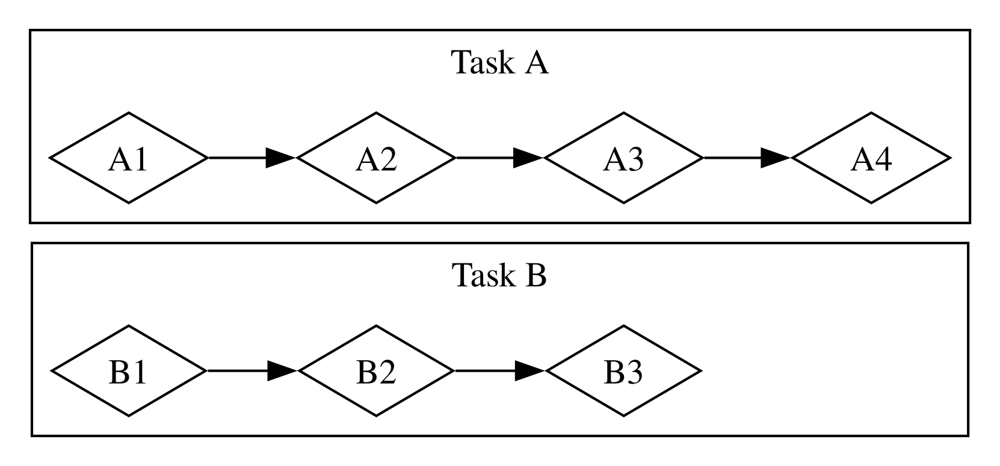

# พื้นฐานของการเขียนโปรแกรมแบบอะซิงโครนัส: Async, Await, ฟิวเจอร์ และสตรีม

งานหรือการประมวลผลหลายๆ อย่างที่เราสั่งให้คอมพิวเตอร์ทำอาจต้องใช้เวลาสักพักกว่าจะเสร็จสิ้น คงจะดีไม่น้อยหากเราสามารถทำอย่างอื่นควบคู่ไปด้วยได้ในระหว่างรอให้กระบวนการที่ใช้เวลานานเหล่านั้นทำงานจนเสร็จ คอมพิวเตอร์ยุคใหม่มีสองเทคนิคหลักสำหรับการทำงานมากกว่าหนึ่งอย่างไปพร้อมกัน นั่นคือการทำงานแบบขนาน (parallelism) และการทำงานพร้อมกัน (concurrency) ทว่าตรรกะของโปรแกรมโดยทั่วไปมักถูกเขียนขึ้นในลักษณะเรียงตามลำดับเป็นเส้นตรง แต่สิ่งที่เราต้องการจริงๆ คือการระบุการทำงานที่โปรแกรมต้องทำ พร้อมทั้งกำหนดจุดที่ฟังก์ชันสามารถหยุดพักชั่วคราวเพื่อให้ส่วนอื่นของโปรแกรมทำงานแทนได้ โดยไม่ต้องมาคอยระบุเจาะจงล่วงหน้าว่าโค้ดแต่ละส่วนจะต้องทำงานด้วยลำดับและลักษณะใดอย่างเคร่งครัด _การเขียนโปรแกรมแบบอะซิงโครนัส (asynchronous programming)_ คือแอ็บสแตรกชันที่เปิดโอกาสให้เราเขียนโค้ดโดยอิงจากจุดพักที่อาจเกิดขึ้นและผลลัพธ์สุดท้ายที่จะได้รับ โดยที่ตัวระบบจะเข้ามาดูแลจัดการรายละเอียดของการประสานงานทั้งหมดให้เราเอง

บทนี้ต่อยอดจากการใช้เธรด (thread) เพื่อการทำงานขนานและการทำงานพร้อมกันในบทที่ 16 โดยจะแนะนำแนวทางเลือกใหม่ในการเขียนโค้ด ได้แก่ ฟิวเจอร์ (future), สตรีม (stream) และไวยากรณ์ `async` กับ `await` ของ Rust ซึ่งเปิดทางให้เราแสดงลักษณะการทำงานแบบอะซิงโครนัสได้อย่างเป็นธรรมชาติ ตลอดจนการใช้งานเครตภายนอกที่อิมพลีเมนต์รันไทม์อะซิงโครนัส (asynchronous runtime) ซึ่งเป็นโค้ดที่คอยควบคุมและประสานการประมวลผลงานแบบอะซิงโครนัสทั้งหมด

ลองพิจารณาตัวอย่าง: สมมติว่าคุณกำลังเอ็กซ์พอร์ต (export) วิดีโองานฉลองครอบครัวที่คุณตัดต่อขึ้น ซึ่งเป็นกระบวนการที่อาจกินเวลาตั้งแต่หลายนาทีไปจนถึงหลายชั่วโมง การเอ็กซ์พอร์ตวิดีโอนี้จะดึงพลังของ CPU และ GPU ไปใช้อย่างเต็มที่ หากเครื่องของคุณมีซีพียูเพียงคอร์เดียว และระบบปฏิบัติการไม่คอยสลับพักการเอ็กซ์พอร์ตนั้นเลยจนกว่าจะเสร็จ (กล่าวคือ รันการเอ็กซ์พอร์ตแบบ_ซิงโครนัส_) คุณก็จะไม่สามารถทำสิ่งอื่นใดบนคอมพิวเตอร์ได้เลยในระหว่างที่งานนั้นกำลังรันอยู่ ซึ่งคงเป็นประสบการณ์ที่น่าหงุดหงิดอย่างยิ่ง แต่โชคดีที่ระบบปฏิบัติการของคอมพิวเตอร์สามารถเข้ามาขัดจังหวะการเอ็กซ์พอร์ตอยู่เบื้องหลังได้บ่อยพอที่จะช่วยให้คุณทำงานอื่นไปพร้อมกันได้

คราวนี้ สมมติว่าคุณกำลังดาวน์โหลดวิดีโอที่มีคนแชร์มา ซึ่งงานนี้อาจต้องใช้เวลาพอสมควรเช่นกันแต่ไม่ได้กินเวลาของ CPU มากนัก ในกรณีนี้ ซีพียูจำเป็นต้องรอให้ข้อมูลส่งข้ามเครือข่ายมาถึง แม้คุณจะเริ่มอ่านข้อมูลได้ทันทีที่ข้อมูลบางส่วนเริ่มทยอยมาถึง แต่มันก็ยังต้องใช้เวลากว่าข้อมูลทั้งหมดจะมาครบถ้วน ยิ่งไปกว่านั้น แม้ข้อมูลจะมาครบแล้ว หากวิดีโอมีขนาดใหญ่มาก การโหลดไฟล์ทั้งหมดก็อาจกินเวลาอย่างน้อย 1-2 วินาที ซึ่งอาจฟังดูสั้นมากสำหรับมนุษย์ แต่ถือเป็นช่วงเวลาที่ยาวนานมหาศาลสำหรับหน่วยประมวลผลยุคใหม่ที่สามารถคำนวณได้หลายพันล้านคำสั่งในแต่ละวินาที และเช่นเคย ระบบปฏิบัติการจะคอยสลับขัดจังหวะโปรแกรมของคุณอยู่เบื้องหลัง เพื่อให้ซีพียูหันไปทำงานอื่นได้ในระหว่างรอการเรียกใช้งานเครือข่ายให้เสร็จสิ้น

การเอ็กซ์พอร์ตวิดีโอจึงเป็นตัวอย่างของงานที่_ผูกติดกับซีพียู (CPU-bound หรือ compute-bound)_ ซึ่งประสิทธิภาพจะถูกจำกัดด้วยขีดความสามารถในการประมวลผลข้อมูลของ CPU หรือ GPU และปริมาณพลังประมวลผลที่สามารถทุ่มเทให้กับงานนั้นได้ ส่วนการดาวน์โหลดวิดีโอเป็นตัวอย่างของงานที่_ผูกติดกับ I/O (I/O-bound)_ เพราะประสิทธิภาพจะถูกจำกัดด้วยความเร็วของ_อินพุตและเอาต์พุต (input and output)_ ของคอมพิวเตอร์ โดยจะทำงานได้เร็วเท่าที่ข้อมูลสามารถรับส่งผ่านเครือข่ายได้เท่านั้น

ในตัวอย่างทั้งสองนี้ การสลับขัดจังหวะอยู่เบื้องหลังของระบบปฏิบัติการถือเป็นการทำงานพร้อมกันรูปแบบหนึ่ง ทว่าการทำงานพร้อมกันดังกล่าวเกิดขึ้นเฉพาะในระดับของโปรแกรมทั้งโปรแกรมเท่านั้น โดยระบบปฏิบัติการจะสลับการทำงานระหว่างโปรแกรมต่างๆ เพื่อให้ทุกโปรแกรมได้ทำงาน แต่ในความเป็นจริง เนื่องจากเราผู้เขียนโปรแกรมเข้าใจการทำงานภายในโปรแกรมของเราในระดับที่ละเอียดยิ่งกว่าระบบปฏิบัติการมาก เราจึงสามารถมองเห็นโอกาสในการจัดการทำงานพร้อมกันในจุดที่ระบบปฏิบัติการมองไม่เห็นได้

ตัวอย่างเช่น หากเรากำลังสร้างเครื่องมือจัดการดาวน์โหลดไฟล์ เราควรเขียนโปรแกรมให้การเริ่มดาวน์โหลดไฟล์หนึ่งไม่ทำให้หน้าจอส่วนติดต่อผู้ใช้ (UI) ค้าง และเปิดให้ผู้ใช้เริ่มดาวน์โหลดหลายๆ ไฟล์ได้พร้อมกัน ทว่า API ของระบบปฏิบัติการสำหรับการสื่อสารผ่านเครือข่ายหลายตัวกลับเป็นแบบ_บล็อก (blocking)_ กล่าวคือ API เหล่านี้จะระงับการทำงานของโปรแกรมไว้จนกว่าข้อมูลที่กำลังประมวลผลจะพร้อมใช้งานอย่างสมบูรณ์

> หมายเหตุ: หากลองพิจารณาดู นี่คือลักษณะการทำงานตามปกติของฟังก์ชัน_เกือบทั้งหมด_ แต่คำว่า _บล็อก (blocking)_ มักจะถูกใช้เรียกการเรียกใช้ฟังก์ชันที่มีปฏิสัมพันธ์กับไฟล์ เครือข่าย หรือทรัพยากรอื่นๆ ของคอมพิวเตอร์ เพราะนั่นคือกรณีที่โปรแกรมของเราจะได้ประโยชน์อย่างชัดเจนหากเปลี่ยนการทำงานให้เป็นแบบ_ไม่บล็อก (non-blocking)_

เราอาจหลีกเลี่ยงการบล็อกเธรดหลักได้ด้วยการแยกสร้างเธรดเฉพาะกิจเพื่อใช้ดาวน์โหลดแต่ละไฟล์ขึ้นมา ทว่าภาระ overhead จากการใช้ทรัพยากรระบบของเธรดเหล่านั้นจะกลายเป็นปัญหาคอขวดในท้ายที่สุด คงจะดีกว่ามากหากการเรียกฟังก์ชันไม่บล็อกการทำงานตั้งแต่แรก และเปิดให้เรากำหนดชุดของงาน (tasks) ที่ต้องการให้โปรแกรมทำให้เสร็จ แล้วปล่อยให้ตัวรันไทม์เป็นผู้ตัดสินใจเลือกลำดับและวิธีรันงานเหล่านั้นให้มีประสิทธิภาพสูงสุดแทน

และนั่นคือสิ่งที่แอ็บสแตรกชัน _async_ (ย่อมาจาก _asynchronous_) ของ Rust มอบให้กับเราพอดี ในบทนี้คุณจะได้เรียนรู้ทุกแง่มุมเกี่ยวกับ async โดยครอบคลุมหัวข้อดังต่อไปนี้:

- วิธีใช้งานไวยากรณ์ `async` และ `await` ของ Rust ตลอดจนการรันฟังก์ชันแบบอะซิงโครนัสด้วยรันไทม์
- วิธีประยุกต์ใช้โมเดลแบบ async เพื่อแก้ไขโจทย์และปัญหาความท้าทายแบบเดียวกับที่เราได้ศึกษาในบทที่ 16
- วิธีที่การเขียนโปรแกรมแบบมัลติเธรดและแบบ async เติมเต็มซึ่งกันและกัน จนคุณสามารถนำทั้งสองแนวทางมาผสานร่วมกันได้ในหลายสถานการณ์

แต่ก่อนจะไปดูว่า async ทำงานอย่างไรในทางปฏิบัติ เราขอแวะทำความเข้าใจความแตกต่างระหว่างการทำงานขนาน (parallelism) และการทำงานพร้อมกัน (concurrency) กันก่อนสักเล็กน้อย

## การทำงานขนานและการทำงานพร้อมกัน

ที่ผ่านมา เราอาจใช้คำว่าการทำงานขนานและการทำงานพร้อมกันแทนกันได้เกือบตลอด แต่ ณ จุดนี้ เราจำเป็นต้องแยกแยะความแตกต่างของทั้งสองแนวคิดนี้ให้ชัดเจนยิ่งขึ้น เพราะความแตกต่างของพวกมันจะมีบทบาทสำคัญเมื่อเราเริ่มลงมือปฏิบัติจริง

ลองพิจารณาตัวอย่างการแบ่งงานในทีมพัฒนาซอฟต์แวร์ คุณอาจมอบหมายงานหลายๆ อย่างให้สมาชิกคนเดียวทำ, มอบหมายงานให้สมาชิกแต่ละคนรับผิดชอบคนละหนึ่งงาน, หรือใช้ทั้งสองแนวทางผสมผสานกัน

เมื่อคนคนหนึ่งสลับทำงานหลายๆ อย่างก่อนที่งานใดงานหนึ่งจะเสร็จสิ้นลง นี่คือ_การทำงานพร้อมกัน (concurrency)_ วิธีหนึ่งในการทำความเข้าใจการทำงานพร้อมกันก็เหมือนกับการที่คุณเปิดสองโปรเจกต์ค้างไว้บนคอมพิวเตอร์ และเมื่อคุณรู้สึกเบื่อหรือติดขัดในโปรเจกต์หนึ่ง คุณก็สลับไปทำอีกโปรเจกต์หนึ่ง เนื่องจากคุณมีเพียงคนเดียว คุณจึงไม่สามารถขยับงานทั้งสองอย่างไปข้างหน้าพร้อมกันเป๊ะๆ ในเสี้ยววินาทีเดียวกันได้ แต่คุณสามารถสลับการทำงาน (multitask) เพื่อให้งานแต่ละชิ้นคืบหน้าไปทีละนิดด้วยการสลับไปมาระหว่างกันได้ (ดูรูปที่ 17-1)

<figure>

<figcaption>รูปที่ 17-1: เวิร์กโฟลว์แบบทำงานพร้อมกัน สลับไปมาระหว่าง Task A และ Task B</figcaption>

</figure>

แต่เมื่อทีมแบ่งงานโดยให้สมาชิกแต่ละคนรับงานไปทำคนละชิ้นและแยกย้ายกันทำ นี่คือ_การทำงานขนาน (parallelism)_ เพราะสมาชิกแต่ละคนในทีมสามารถขับเคลื่อนงานของตนให้คืบหน้าไปได้ในเวลาเดียวกันอย่างแท้จริง (ดูรูปที่ 17-2)

<figure>

<figcaption>รูปที่ 17-2: เวิร์กโฟลว์แบบขนาน ซึ่งงานดำเนินไปบน Task A และ Task B อย่างเป็นอิสระจากกัน</figcaption>

</figure>

ในเวิร์กโฟลว์ทั้งสองรูปแบบ คุณอาจจำเป็นต้องประสานงานระหว่างแต่ละงาน บางทีคุณอาจคิดว่างานที่มอบหมายให้คนคนหนึ่งนั้นเป็นอิสระจากงานของคนอื่นโดยสิ้นเชิง แต่ในความเป็นจริงกลับต้องรอให้อีกคนทำงานของเขาให้เสร็จเสียก่อน งานบางส่วนจึงอาจทำแบบขนานได้ แต่งานบางส่วนแท้จริงแล้วกลับเป็นแบบ_อนุกรม (serial)_ คือต้องทำเรียงตามลำดับทีละงาน ต่อเนื่องกันไปดังแสดงในรูปที่ 17-3

<figure>

<figcaption>รูปที่ 17-3: เวิร์กโฟลว์แบบขนานบางส่วน ซึ่งงานดำเนินไปบน Task A และ Task B อย่างเป็นอิสระจากกันจนกระทั่ง Task A3 ถูกบล็อกรอผลลัพธ์ของ Task B3</figcaption>

</figure>

ในทำนองเดียวกัน คุณอาจพบว่างานชิ้นหนึ่งของคุณจำเป็นต้องรองานอีกชิ้นของตัวคุณเองให้เสร็จก่อน ซึ่งจะทำให้การทำงานพร้อมกันของคุณกลายเป็นการทำงานแบบอนุกรมไปโดยปริยาย

การทำงานขนานและการทำงานพร้อมกันยังสามารถคาบเกี่ยวกันได้อีกด้วย หากคุณทราบว่าเพื่อนร่วมงานกำลังติดขัดรอคุณทำงานชิ้นหนึ่งให้เสร็จ คุณก็คงจะต้องทุ่มเทสรรพกำลังทั้งหมดไปที่งานชิ้นนั้นเพื่อ “ปลดบล็อก” ให้เพื่อนร่วมงาน ซึ่งในจังหวะนั้น คุณและเพื่อนร่วมงานก็ไม่สามารถทำงานแบบขนานกันได้อีกต่อไป และตัวคุณเองก็ไม่สามารถสลับไปทำงานอื่นพร้อมๆ กันได้เช่นกัน

พลวัตพื้นฐานรูปแบบเดียวกันนี้เกิดขึ้นกับการทำงานของซอฟต์แวร์และฮาร์ดแวร์เช่นเดียวกัน บนคอมพิวเตอร์ที่มีซีพียูเพียงคอร์เดียว ซีพียูสามารถประมวลผลคำสั่งได้ครั้งละหนึ่งอย่างเท่านั้น แต่ก็ยังสามารถทำงานแบบพร้อมกัน (concurrently) ได้ โดยอาศัยเครื่องมืออย่างเธรด (threads), โปรเซส (processes) และ async ที่ทำให้คอมพิวเตอร์สามารถพักกิจกรรมหนึ่งไว้ชั่วคราว แล้วสลับไปทำกิจกรรมอื่น ก่อนจะวนกลับมาทำกิจกรรมแรกใหม่อีกครั้ง ในทางกลับกัน บนเครื่องที่มีซีพียูหลายคอร์ คอมพิวเตอร์จะสามารถทำงานแบบขนาน (in parallel) ได้อย่างแท้จริง คอร์หนึ่งอาจกำลังประมวลผลงานหนึ่ง ในขณะที่อีกคอร์หนึ่งกำลังทำงานอื่นที่ไม่เกี่ยวข้องกันเลยไปพร้อมๆ กันในเสี้ยววินาทีเดียวกัน

การรันโค้ด async ใน Rust มักจะทำงานในลักษณะแบบพร้อมกัน (concurrently) และอาจนำการทำงานแบบขนาน (parallelism) มาใช้ร่วมกันอยู่เบื้องหลัง ทั้งนี้ขึ้นอยู่กับฮาร์ดแวร์ ระบบปฏิบัติการ ตลอดจนรันไทม์ async ที่เราเลือกใช้ (ซึ่งเราจะได้กล่าวถึงรันไทม์ async เพิ่มเติมในอีกไม่ช้า)

คราวนี้ เรามาเจาะลึกกลไกการทำงานที่แท้จริงของการเขียนโปรแกรมแบบ async ใน Rust กันเลย
