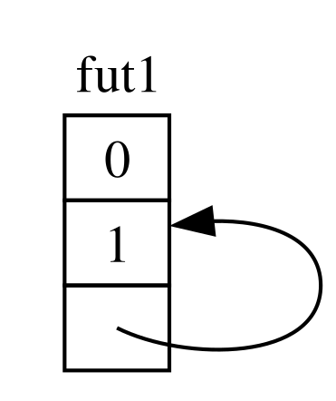
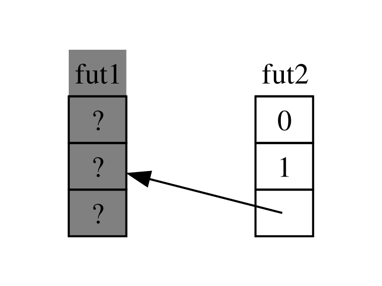
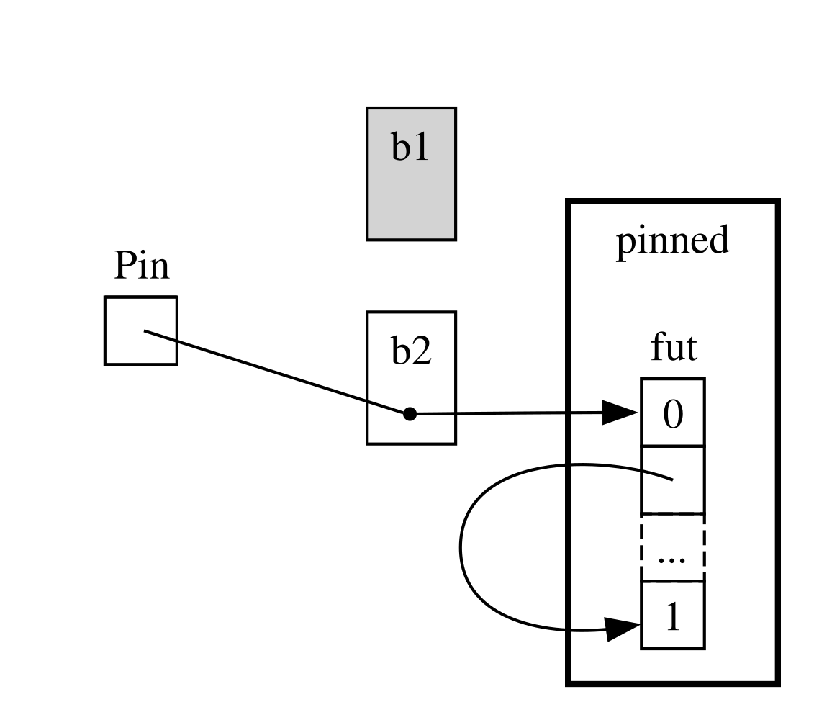
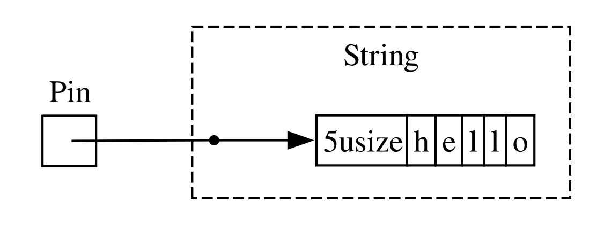

<!-- Old headings. Do not remove or links may break. -->

<a id="digging-into-the-traits-for-async"></a>

## เจาะลึกเทรตสำหรับ async

ตลอดทั้งบทนี้ เราได้ใช้เทรต (trait) `Future`, `Stream` และ `StreamExt` ในหลากหลายรูปแบบ อย่างไรก็ตาม จนถึงตอนนี้เรายังหลีกเลี่ยงการลงลึกในรายละเอียดว่าพวกมันทำงานอย่างไรหรือประกอบเข้าด้วยกันอย่างไร ซึ่งโดยทั่วไปแล้วเพียงพอสำหรับการเขียนโค้ด Rust ในชีวิตประจำวันของคุณ แต่ในบางครั้ง คุณอาจต้องเจอกับสถานการณ์ที่จำเป็นต้องเข้าใจรายละเอียดเพิ่มเติมของเทรตเหล่านี้ พร้อมทั้งชนิดข้อมูล `Pin` และเทรต `Unpin` ในหัวข้อนี้ เราจะเจาะลึกพอให้คุณสามารถรับมือกับสถานการณ์เหล่านั้นได้ โดยขอละเว้นการลงลึก_ระดับโครงสร้างภายในจริงๆ_ ไว้ให้เอกสารอ้างอิงอื่นๆ

<!-- Old headings. Do not remove or links may break. -->

<a id="future"></a>

### เทรต `Future`

เรามาเริ่มต้นด้วยการพิจารณาอย่างละเอียดว่าเทรต `Future` ทำงานอย่างไร นี่คือนิยามที่ Rust กำหนดไว้:

```rust
use std::pin::Pin;
use std::task::{Context, Poll};

pub trait Future {
    type Output;

    fn poll(self: Pin<&mut Self>, cx: &mut Context<'_>) -> Poll<Self::Output>;
}
```

คำนิยามเทรตดังกล่าวมีชนิดข้อมูลใหม่หลายชนิด และยังมีวากยสัมพันธ์บางอย่างที่เราไม่เคยเห็นมาก่อน ดังนั้นเรามาพิจารณานิยามนี้ทีละส่วนกัน

อย่างแรก ชนิดข้อมูลสัมพันธ์ (associated type) `Output` ของ `Future` จะระบุว่าฟิวเจอร์นี้จะคืนผลลัพธ์ (resolve) ออกมาเป็นค่าชนิดใด ซึ่งเทียบได้กับชนิดข้อมูลสัมพันธ์ `Item` ของเทรต `Iterator` อย่างที่สอง `Future` มีเมธอด `poll` ซึ่งรับเรเฟอเรนซ์พิเศษแบบ `Pin` เป็นพารามิเตอร์ `self` และรับเรเฟอเรนซ์แบบมิวเทเบิลไปยังชนิด `Context` จากนั้นจะคืนค่าเป็น `Poll<Self::Output>` เราจะพูดถึง `Pin` และ `Context` กันในอีกสักครู่ ตอนนี้เรามาดูสิ่งที่เมธอดนี้คืนค่ากลับมาก่อน นั่นคือชนิดข้อมูล `Poll`:

```rust
pub enum Poll<T> {
    Ready(T),
    Pending,
}
```

ชนิดข้อมูล `Poll` นี้คล้ายกับ `Option`: คือมีวาเรียนต์ที่มีค่าอยู่ภายในคือ `Ready(T)` และวาเรียนต์ที่ไม่มีค่าคือ `Pending` อย่างไรก็ตาม `Poll` มีความหมายที่แตกต่างจาก `Option` อย่างมาก! โดยวาเรียนต์ `Pending` จะบ่งบอกว่าฟิวเจอร์ยังมีงานที่ต้องทำค้างอยู่ ผู้เรียกจึงต้องกลับมาตรวจสอบใหม่อีกครั้งในภายหลัง ส่วนวาเรียนต์ `Ready` จะบ่งบอกว่า `Future` ทำงานเสร็จสิ้นแล้ว และมีค่า `T` พร้อมให้ใช้งาน

> หมายเหตุ: แทบจะไม่มีกรณีที่คุณต้องเรียก `poll` โดยตรง แต่หากคุณจำเป็นต้องเรียกจริงๆ พึงระลึกไว้ว่าสำหรับฟิวเจอร์ส่วนใหญ่แล้ว ผู้เรียกไม่ควรเรียก `poll` ซ้ำอีกหลังจากที่ฟิวเจอร์คืนค่า `Ready` ออกมาแล้ว ฟิวเจอร์หลายตัวจะแพนิกหากถูกโพลล์ซ้ำหลังจากพร้อมแล้ว ฟิวเจอร์ตัวใดที่ปลอดภัยต่อการโพลล์ซ้ำจะระบุไว้อย่างชัดเจนในเอกสารประกอบของมัน ซึ่งพฤติกรรมนี้จะคล้ายคลึงกับ `Iterator::next`

เมื่อคุณเห็นโค้ดที่ใช้ `await` เบื้องหลังแล้ว Rust จะคอมไพล์มันให้กลายเป็นโค้ดที่เรียก `poll` หากคุณย้อนกลับไปดูในลิสติ้ง 17-4 ที่เราพิมพ์ชื่อเรื่องของเพจสำหรับ URL เดียวเมื่อมันได้ผลลัพธ์แล้ว Rust จะคอมไพล์โค้ดดังกล่าวออกมาเป็นสิ่งที่ใกล้เคียง (แม้จะไม่เหมือนเป๊ะๆ) กับโค้ดนี้:

```rust,ignore
match page_title(url).poll() {
    Ready(page_title) => match page_title {
        Some(title) => println!("The title for {url} was {title}"),
        None => println!("{url} had no title"),
    }
    Pending => {
        // But what goes here?
    }
}
```

เมื่อฟิวเจอร์ยังคงเป็น `Pending` อยู่ เราควรทำอย่างไรต่อไป? เราจำเป็นต้องมีวิธีลองใหม่ซ้ำแล้วซ้ำเล่าจนกว่าฟิวเจอร์จะพร้อมในที่สุด หรือพูดอีกอย่างหนึ่งคือ เราจำเป็นต้องมีลูป:

```rust,ignore
let mut page_title_fut = page_title(url);
loop {
    match page_title_fut.poll() {
        Ready(value) => match page_title {
            Some(title) => println!("The title for {url} was {title}"),
            None => println!("{url} had no title"),
        }
        Pending => {
            // continue
        }
    }
}
```

อย่างไรก็ตาม หาก Rust คอมไพล์มันออกมาเป็นโค้ดแบบนั้นเป๊ะๆ ทุกๆ `await` ก็จะกลายเป็นการบล็อกการทำงาน—ซึ่งตรงกันข้ามกับสิ่งที่เราต้องการอย่างสิ้นเชิง! แทนที่จะทำเช่นนั้น Rust จะทำให้แน่ใจว่าลูปดังกล่าวสามารถส่งต่อการควบคุมไปยังสิ่งอื่นที่สามารถหยุดพักการทำงานของฟิวเจอร์นี้ชั่วคราว เพื่อสลับไปทำงานกับฟิวเจอร์อื่นๆ แล้วค่อยกลับมาตรวจสอบฟิวเจอร์นี้ใหม่ในภายหลัง และดังที่เราได้เห็นมาแล้ว สิ่งนั้นก็คือรันไทม์ (runtime) แบบ async ซึ่งการจัดตารางเวลาและการประสานงานนี้ก็คืองานหลักอย่างหนึ่งของมัน

ในหัวข้อ[“การส่งข้อมูลระหว่างสองทาสก์ด้วยการส่งผ่านข้อความ”][message-passing]<!-- ignore --> เราได้อธิบายการรอ `rx.recv` ไปแล้ว การเรียก `recv` จะคืนค่าเป็นฟิวเจอร์ และการ await ฟิวเจอร์นั้นก็คือการโพลล์มัน เราได้ตั้งข้อสังเกตไว้ว่ารันไทม์จะหยุดพักฟิวเจอร์ไว้ชั่วคราวจนกว่ามันจะพร้อมใช้งานด้วยค่า `Some(message)` หรือเป็น `None` เมื่อแชนเนลปิดลง ด้วยความเข้าใจที่ลึกซึ้งยิ่งขึ้นของเราเกี่ยวกับเทรต `Future` และโดยเฉพาะอย่างยิ่ง `Future::poll` ทำให้เราเห็นแล้วว่ามันทำงานอย่างไร รันไทม์จะรู้ว่าฟิวเจอร์ยังไม่พร้อมเมื่อมันคืนค่า `Poll::Pending` ในทางกลับกัน รันไทม์จะรู้ว่าฟิวเจอร์_พร้อม_แล้วและผลักดันการทำงานของมันต่อไปเมื่อ `poll` คืนค่า `Poll::Ready(Some(message))` หรือ `Poll::Ready(None)`

รายละเอียดที่แน่ชัดว่ารันไทม์จัดการเรื่องนี้อย่างไรนั้นอยู่นอกเหนือขอบเขตของหนังสือเล่มนี้ แต่หัวใจสำคัญคือการเข้าใจกลไกพื้นฐานของฟิวเจอร์: รันไทม์จะ_โพลล์_ฟิวเจอร์แต่ละตัวที่อยู่ในความรับผิดชอบของมัน และสั่งให้ฟิวเจอร์กลับไปหลับเมื่อมันยังไม่พร้อมทำงาน

<!-- Old headings. Do not remove or links may break. -->

<a id="pinning-and-the-pin-and-unpin-traits"></a>
<a id="the-pin-and-unpin-traits"></a>

### ชนิด `Pin` และเทรต `Unpin`

ย้อนกลับไปในลิสติ้ง 17-13 เราใช้มาโคร `trpl::join!` เพื่อ await ฟิวเจอร์สามตัว อย่างไรก็ตาม ในการใช้งานจริงมักจะมีคอลเลกชัน เช่น เวกเตอร์ที่บรรจุฟิวเจอร์จำนวนหนึ่งซึ่งเราจะไม่รู้จำนวนที่แน่นอนจนกว่าจะถึงเวลาทำงานจริง (runtime) เรามาลองเปลี่ยนลิสติ้ง 17-13 ให้เป็นโค้ดในลิสติ้ง 17-23 ที่นำฟิวเจอร์ทั้งสามตัวใส่ลงในเวกเตอร์แล้วเรียกใช้ฟังก์ชัน `trpl::join_all` แทน ซึ่งตอนนี้จะยังคอมไพล์ไม่ผ่าน

<Listing number="17-23" caption="การ await ฟิวเจอร์ในคอลเลกชัน"  file-name="src/main.rs">

```rust,ignore,does_not_compile
{{#rustdoc_include ../listings/ch17-async-await/listing-17-23/src/main.rs:here}}
```

</Listing>

เราใส่ฟิวเจอร์แต่ละตัวไว้ใน `Box` เพื่อให้มันกลายเป็น_เทรตออบเจกต์_ (trait object) เช่นเดียวกับที่เราเคยทำในหัวข้อ “การคืนค่าข้อผิดพลาดจาก `run`” ในบทที่ 12 (เราจะอธิบายเรื่องเทรตออบเจกต์อย่างละเอียดในบทที่ 18) การใช้เทรตออบเจกต์ช่วยให้เราสามารถจัดการกับฟิวเจอร์นิรนามแต่ละตัวที่ถูกสร้างขึ้นให้เป็นชนิดเดียวกันได้ เนื่องจากทุกตัวต่างก็อิมพลีเมนต์เทรต `Future` เหมือนกัน

สิ่งนี้อาจฟังดูน่าแปลกใจ เพราะอย่างไรเสีย ไม่มีบล็อก async ตัวใดเลยที่คืนค่าใดๆ กลับมา ดังนั้นแต่ละตัวจึงสร้าง `Future<Output = ()>` ขึ้นมา แต่พึงระลึกไว้ว่า `Future` เป็นเทรต และคอมไพเลอร์จะสร้าง enum ที่ไม่ซ้ำกันขึ้นมาสำหรับแต่ละบล็อก async แม้ว่าพวกมันจะมีชนิดข้อมูลของเอาต์พุตที่เหมือนกันก็ตาม เช่นเดียวกับที่คุณไม่สามารถใส่ struct สองชนิดที่เขียนขึ้นมาต่างกันลงใน `Vec` เดียวกันได้ คุณก็ไม่สามารถใส่ enum ที่คอมไพเลอร์สร้างขึ้นต่างชนิดกันลงไปด้วยเช่นกัน

จากนั้นเราส่งคอลเลกชันของฟิวเจอร์ให้กับฟังก์ชัน `trpl::join_all` แล้ว await ผลลัพธ์ แต่โค้ดนี้คอมไพล์ไม่ผ่าน นี่คือส่วนสำคัญของข้อความแสดงข้อผิดพลาด:

<!-- manual-regeneration
cd listings/ch17-async-await/listing-17-23
cargo build
copy *only* the final `error` block from the errors
-->

```text
error[E0277]: `dyn Future<Output = ()>` cannot be unpinned
  --> src/main.rs:48:33
   |
48 |         trpl::join_all(futures).await;
   |                                 ^^^^^ the trait `Unpin` is not implemented for `dyn Future<Output = ()>`
   |
   = note: consider using the `pin!` macro
           consider using `Box::pin` if you need to access the pinned value outside of the current scope
   = note: required for `Box<dyn Future<Output = ()>>` to implement `Future`
note: required by a bound in `futures_util::future::join_all::JoinAll`
  --> file:///home/.cargo/registry/src/index.crates.io-1949cf8c6b5b557f/futures-util-0.3.30/src/future/join_all.rs:29:8
   |
27 | pub struct JoinAll<F>
   |            ------- required by a bound in this struct
28 | where
29 |     F: Future,
   |        ^^^^^^ required by this bound in `JoinAll`
```

หมายเหตุในข้อความแสดงข้อผิดพลาดนี้บอกให้เราใช้มาโคร `pin!` เพื่อ_ตรึง_ (pin) ค่าเหล่านั้น ซึ่งหมายถึงการนำค่านั้นไปใส่ไว้ในชนิดข้อมูล `Pin` ที่รับประกันว่าค่านั้นจะไม่ถูกย้ายตำแหน่งในหน่วยความจำ ข้อความแสดงข้อผิดพลาดบอกว่าจำเป็นต้องตรึงค่าเพราะ `dyn Future<Output = ()>` ต้องอิมพลีเมนต์เทรต `Unpin` แต่ในตอนนี้มันยังไม่ได้อิมพลีเมนต์

ฟังก์ชัน `trpl::join_all` คืนค่า struct ที่ชื่อ `JoinAll` ซึ่ง struct ดังกล่าวเป็นเจเนอริกบนชนิดข้อมูล `F` ที่ถูกจำกัดให้อิมพลีเมนต์เทรต `Future` การ await ฟิวเจอร์โดยตรงด้วยคีย์เวิร์ด `await` จะทำการตรึงฟิวเจอร์นั้นโดยปริยาย นั่นคือเหตุผลที่เราไม่จำเป็นต้องใช้ `pin!` ในทุกๆ ที่ที่เราต้องการ await ฟิวเจอร์

อย่างไรก็ตาม ในกรณีนี้เราไม่ได้ await ฟิวเจอร์โดยตรง แต่เรากำลังสร้างฟิวเจอร์ใหม่ที่ชื่อ JoinAll ขึ้นมาด้วยการส่งคอลเลกชันของฟิวเจอร์เข้าไปยังฟังก์ชัน `join_all` ซิกเนเจอร์ (signature) ของ `join_all` กำหนดให้สมาชิกทุกตัวในคอลเลกชันต้องอิมพลีเมนต์เทรต `Future` และ `Box<T>` จะอิมพลีเมนต์ `Future` ได้ก็ต่อเมื่อ `T` ที่มันห่อหุ้มอยู่นั้นเป็นฟิวเจอร์ที่อิมพลีเมนต์เทรต `Unpin` เท่านั้น

นั่นเป็นเรื่องที่มีรายละเอียดค่อนข้างมาก! เพื่อให้เข้าใจได้อย่างถ่องแท้ เรามาเจาะลึกกันอีกเล็กน้อยว่าเทรต `Future` ทำงานอย่างไร โดยเฉพาะอย่างยิ่งในเรื่องของการตรึง เรามาดูคำนิยามของเทรต `Future` กันอีกครั้ง:

```rust
use std::pin::Pin;
use std::task::{Context, Poll};

pub trait Future {
    type Output;

    // Required method
    fn poll(self: Pin<&mut Self>, cx: &mut Context<'_>) -> Poll<Self::Output>;
}
```

พารามิเตอร์ `cx` และชนิดข้อมูล `Context` ของมันคือกุญแจสำคัญที่ทำให้รันไทม์รู้ว่าเมื่อใดควรกลับมาตรวจสอบฟิวเจอร์ที่กำหนด ในขณะที่ยังคงคุณสมบัติความเลซี่ (lazy) ไว้ได้ และย้ำอีกครั้งว่า รายละเอียดการทำงานของมันอยู่นอกเหนือขอบเขตของบทนี้ โดยทั่วไปคุณจะต้องคำนึงถึงเรื่องนี้เฉพาะตอนเขียนการอิมพลีเมนต์ `Future` ขึ้นมาเองเท่านั้น เราจะเน้นไปที่ชนิดข้อมูลของ `self` แทน เพราะนี่เป็นครั้งแรกที่เราได้เห็นเมธอดที่มีการระบุชนิดข้อมูล (type annotation) ให้กับ `self` การระบุชนิดข้อมูลให้กับ `self` จะทำงานเหมือนกับการระบุชนิดข้อมูลให้พารามิเตอร์อื่นๆ ของฟังก์ชัน แต่มีความแตกต่างสำคัญสองประการ:

- มันบอกให้ Rust ทราบว่า `self` ต้องเป็นชนิดข้อมูลใดจึงจะสามารถเรียกใช้เมธอดนี้ได้
- มันไม่ใช่ชนิดข้อมูลอะไรก็ได้ตามใจชอบ แต่ถูกจำกัดให้ต้องเป็นชนิดที่เมธอดนั้นถูกอิมพลีเมนต์อยู่, เป็นเรเฟอเรนซ์หรือสมาร์ตพอยน์เตอร์ไปยังชนิดนั้น, หรือเป็น `Pin` ที่ห่อหุ้มเรเฟอเรนซ์ไปยังชนิดนั้น

เราจะได้เห็นวากยสัมพันธ์นี้เพิ่มเติมใน[บทที่ 18][ch-18]<!-- ignore --> สำหรับตอนนี้ ขอเพียงรู้ว่าหากเราต้องการโพลล์ฟิวเจอร์เพื่อตรวจดูว่ามันเป็น `Pending` หรือ `Ready(Output)` เราจำเป็นต้องมีเรเฟอเรนซ์แบบมิวเทเบิลที่ถูกห่อหุ้มด้วย `Pin` ชี้ไปยังชนิดข้อมูลนั้น

`Pin` คือตัวห่อหุ้ม (wrapper) สำหรับชนิดข้อมูลที่ทำหน้าที่เสมือนพอยน์เตอร์ เช่น `&`, `&mut`, `Box` และ `Rc` (ในทางเทคนิค `Pin` ทำงานกับชนิดข้อมูลใดก็ตามที่อิมพลีเมนต์เทรต `Deref` หรือ `DerefMut` ซึ่งในทางปฏิบัติก็เทียบเท่ากับการทำงานกับเรเฟอเรนซ์และสมาร์ตพอยน์เตอร์นั่นเอง) ตัว `Pin` เองไม่ใช่พอยน์เตอร์และไม่มีพฤติกรรมเฉพาะตัวแบบที่ `Rc` หรือ `Arc` มีการนับจำนวนเรเฟอเรนซ์ (reference counting) มันเป็นเพียงเครื่องมือที่คอมไพเลอร์ใช้บังคับใช้ข้อจำกัดในการใช้งานพอยน์เตอร์เท่านั้น

การระลึกได้ว่า `await` ถูกอิมพลีเมนต์ขึ้นจากการเรียก `poll` เริ่มช่วยอธิบายข้อความแสดงข้อผิดพลาดที่เราเห็นก่อนหน้านี้ได้ แต่ข้อความนั้นพูดถึง `Unpin` ไม่ใช่ `Pin` แล้ว `Pin` กับ `Unpin` สัมพันธ์กันอย่างไรกันแน่ และทำไม `Future` ถึงต้องการให้ `self` อยู่ในชนิด `Pin` เพื่อเรียก `poll`?

ย้อนนึกถึงตอนต้นบทนี้ว่า ชุดของจุด await ในฟิวเจอร์จะถูกคอมไพล์ให้กลายเป็นสเตตแมชชีน และคอมไพเลอร์จะทำให้แน่ใจว่าสเตตแมชชีนนั้นปฏิบัติตามกฎความปลอดภัยปกติทั้งหมดของ Rust รวมถึงการยืมและความเป็นเจ้าของ เพื่อให้กลไกนี้ทำงานได้ Rust จะตรวจสอบว่าต้องใช้ข้อมูลใดบ้างระหว่างจุด await หนึ่งไปยังจุด await ถัดไป หรือจนถึงจุดสิ้นสุดของบล็อก async จากนั้นมันจะสร้างวาเรียนต์ที่สอดคล้องกันขึ้นในสเตตแมชชีนที่ถูกคอมไพล์แล้ว วาเรียนต์แต่ละตัวจะได้รับสิทธิ์ในการเข้าถึงข้อมูลที่จำเป็นสำหรับโค้ดส่วนนั้น ไม่ว่าจะโดยการรับความเป็นเจ้าของข้อมูล หรือโดยการถือเรเฟอเรนซ์แบบมิวเทเบิลหรืออิมมิวเทเบิลไปยังข้อมูลนั้น

จนถึงตอนนี้ทุกอย่างก็ดูราบรื่นดี: หากเราทำสิ่งใดผิดพลาดเกี่ยวกับความเป็นเจ้าของหรือเรเฟอเรนซ์ในบล็อก async ตัวตรวจการยืม (borrow checker) ก็จะแจ้งเตือนเรา แต่เมื่อเราต้องการย้ายฟิวเจอร์ที่สอดคล้องกับบล็อกนั้นไปมา—เช่น การย้ายมันเข้าไปใน `Vec` เพื่อส่งให้ `join_all`—เรื่องราวก็จะเริ่มซับซ้อนขึ้น

เมื่อเราย้ายฟิวเจอร์ ไม่ว่าจะเป็นการพุชมันเข้าไปในโครงสร้างข้อมูลเพื่อนำไปใช้เป็นอิเทอเรเตอร์กับ `join_all` หรือการส่งคืนค่ามันกลับมาจากฟังก์ชัน นั่นหมายถึงการย้ายสเตตแมชชีนที่ Rust สร้างขึ้นให้เราจริงๆ และไม่เหมือนกับชนิดข้อมูลอื่นๆ ส่วนใหญ่ใน Rust ฟิวเจอร์ที่ Rust สร้างขึ้นสำหรับบล็อก async อาจมีเรเฟอเรนซ์ที่ชี้กลับมายังตัวเอง (self-referential) อยู่ในฟิลด์ของวาเรียนต์ใดวาเรียนต์หนึ่งได้ ดังแสดงในภาพประกอบอย่างง่ายในรูปที่ 17-4

<figure>



<figcaption>รูปที่ 17-4: ชนิดข้อมูลที่อ้างถึงตัวเอง</figcaption>

</figure>

อย่างไรก็ตาม โดยปริยายแล้ว วัตถุใดๆ ที่มีเรเฟอเรนซ์ชี้กลับมายังตัวเองจะไม่ปลอดภัยต่อการย้ายตำแหน่ง เพราะเรเฟอเรนซ์จะชี้ไปยังแอดเดรสหน่วยความจำจริงของสิ่งที่มันอ้างถึงเสมอ (ดูรูปที่ 17-5) หากคุณย้ายตัวโครงสร้างข้อมูลนั้นเอง เรเฟอเรนซ์ภายในเหล่านั้นจะยังคงชี้ไปยังตำแหน่งเดิม แต่ตำแหน่งหน่วยความจำเดิมนั้นไม่ถูกต้องอีกต่อไปแล้ว ประการหนึ่ง ค่าของมันจะไม่ถูกอัปเดตเมื่อคุณแก้ไขโครงสร้างข้อมูล และอีกประการหนึ่ง—ซึ่งสำคัญยิ่งกว่า—คอมพิวเตอร์สามารถนำพื้นที่หน่วยความจำตรงนั้นไปใช้ซ้ำสำหรับงานอื่นได้แล้ว! คุณอาจลงเอยด้วยการอ่านข้อมูลที่ไม่เกี่ยวข้องกันเลยในภายหลัง

<figure>



<figcaption>รูปที่ 17-5: ผลลัพธ์ที่ไม่ปลอดภัยของการย้ายชนิดข้อมูลที่อ้างถึงตัวเอง</figcaption>

</figure>

ในทางทฤษฎี คอมไพเลอร์ของ Rust อาจพยายามอัปเดตทุกเรเฟอเรนซ์ที่ชี้ไปยังวัตถุทุกครั้งที่มีการย้ายตำแหน่ง แต่นั่นอาจเพิ่ม overhead ด้านประสิทธิภาพอย่างมหาศาล โดยเฉพาะอย่างยิ่งหากต้องอัปเดตเครือข่ายของเรเฟอเรนซ์ที่เชื่อมโยงกันทั้งหมด แต่หากเราสามารถทำให้มั่นใจได้ว่าโครงสร้างข้อมูลนั้น_จะไม่เคลื่อนย้ายในหน่วยความจำ_ เราก็ไม่จำเป็นต้องอัปเดตเรเฟอเรนซ์ใดๆ เลย นี่คือสิ่งที่ตัวตรวจการยืมของ Rust มีหน้าที่จัดการพอดี: ในโค้ดที่ปลอดภัย (safe code) มันจะป้องกันไม่ให้คุณย้ายข้อมูลใดๆ ที่มีเรเฟอเรนซ์ที่ยังใช้งานอยู่ชี้ไปยังมัน

`Pin` ต่อยอดจากแนวคิดดังกล่าวเพื่อมอบการรับประกันตามที่เราต้องการ เมื่อเรา_ตรึง_ค่าด้วยการห่อหุ้มพอยน์เตอร์ที่ชี้ไปยังค่านั้นไว้ใน `Pin` ค่านั้นจะไม่สามารถเคลื่อนย้ายตำแหน่งได้อีกต่อไป ดังนั้น หากคุณมี `Pin<Box<SomeType>>` คุณกำลังตรึงค่า `SomeType` จริงๆ _ไม่ใช่_การตรึงพอยน์เตอร์ `Box` รูปที่ 17-6 แสดงภาพของกระบวนการนี้

<figure>


<figcaption>รูปที่ 17-6: การตรึง `Box` ที่ชี้ไปยังชนิดฟิวเจอร์ที่อ้างถึงตัวเอง</figcaption>

</figure>

ในความเป็นจริง พอยน์เตอร์ `Box` ยังคงเคลื่อนย้ายไปมาได้อย่างอิสระ พึงระลึกว่า: สิ่งที่เราให้ความสำคัญคือการทำให้แน่ใจว่าข้อมูลปลายทางที่ถูกอ้างถึงนั้นจะอยู่กับที่เดิม หากพอยน์เตอร์ถูกย้าย _แต่ข้อมูลที่มันชี้ไป_ ยังคงอยู่ที่เดิม ดังในรูปที่ 17-7 ก็จะไม่เกิดปัญหาใดๆ ทั้งสิ้น (ในฐานะแบบฝึกหัดเพิ่มเติม ลองเปิดดูเอกสารประกอบของชนิดข้อมูลเหล่านี้รวมถึงมอดูล `std::pin` แล้วลองคิดดูว่าคุณจะทำเช่นนี้กับ `Pin` ที่ห่อ `Box` ได้อย่างไร) หัวใจสำคัญคือ ชนิดข้อมูลที่อ้างถึงตัวเองจะต้องไม่ขยับย้ายที่ เพราะมันยังคงถูกตรึงอยู่

<figure>



<figcaption>รูปที่ 17-7: การย้าย `Box` ที่ชี้ไปยังชนิดฟิวเจอร์ที่อ้างถึงตัวเอง</figcaption>

</figure>

อย่างไรก็ตาม ชนิดข้อมูลส่วนใหญ่มีความปลอดภัยอย่างสมบูรณ์ในการย้ายไปมา แม้ว่ามันจะอยู่เบื้องหลังพอยน์เตอร์ `Pin` ก็ตาม เราจำเป็นต้องคำนึงถึงการตรึงเฉพาะเมื่อข้อมูลนั้นมีเรเฟอเรนซ์ภายในเท่านั้น ค่าพื้นฐานดั้งเดิม (primitive) เช่น ตัวเลขและบูลีนนั้นปลอดภัยแน่นอนเพราะพวกมันไม่มีเรเฟอเรนซ์ภายใน ชนิดข้อมูลส่วนใหญ่ที่คุณใช้งานทั่วไปใน Rust ก็เช่นกัน คุณสามารถย้าย `Vec` ไปมาได้โดยไม่ต้องกังวล ตัวอย่างเช่น จากสิ่งที่เราเห็นมา หากคุณมี `Pin<Vec<String>>` คุณจะต้องทำทุกอย่างผ่าน API ที่ปลอดภัยแต่เข้มงวดที่ `Pin` กำหนดไว้ ทั้งๆ ที่ความจริงแล้ว `Vec<String>` นั้นปลอดภัยที่จะย้ายตำแหน่งเสมอหากไม่มีเรเฟอเรนซ์อื่นชี้ไปยังมัน เราจึงจำเป็นต้องมีวิธีบอกคอมไพเลอร์ว่าการย้ายข้อมูลในกรณีเช่นนี้เป็นเรื่องที่ปลอดภัยอย่างสมบูรณ์ และนั่นคือจุดที่ `Unpin` เข้ามามีบทบาท

`Unpin` เป็นเทรตมาร์กเกอร์ (marker trait) คล้ายกับเทรต `Send` และ `Sync` ที่เราเห็นในบทที่ 16 ดังนั้นมันจึงไม่มีฟังก์ชันการทำงานเป็นของตัวเอง เทรตมาร์กเกอร์มีอยู่เพียงเพื่อบอกคอมไพเลอร์ว่าการใช้ชนิดข้อมูลที่อิมพลีเมนต์เทรตนั้นในบริบทเฉพาะเป็นเรื่องที่ปลอดภัย `Unpin` จะแจ้งให้คอมไพเลอร์ทราบว่าชนิดข้อมูลดังกล่าว_ไม่_จำเป็นต้องยึดถือการรับประกันใดๆ ในเรื่องการห้ามย้ายค่า

<!--
  The inline `<code>` in the next block is to allow the inline `<em>` inside it,
  matching what NoStarch does style-wise, and emphasizing within the text here
  that it is something distinct from a normal type.
-->

เช่นเดียวกับ `Send` และ `Sync` คอมไพเลอร์จะอิมพลีเมนต์ `Unpin` ให้โดยอัตโนมัติสำหรับทุกชนิดข้อมูลที่สามารถพิสูจน์ได้ว่าปลอดภัย ส่วนกรณีพิเศษ ซึ่งก็คล้ายกับ `Send` และ `Sync` อีกเช่นกัน คือกรณีที่ `Unpin` _ไม่ได้_ถูกอิมพลีเมนต์สำหรับชนิดข้อมูลนั้น สัญลักษณ์สำหรับกรณีนี้คือ <code>impl !Unpin for <em>SomeType</em></code> โดยที่ <code><em>SomeType</em></code> คือชื่อของชนิดข้อมูลที่_จำเป็น_ต้องยึดถือการรับประกันเหล่านั้นเพื่อให้ปลอดภัยทุกครั้งที่พอยน์เตอร์ไปยังชนิดนั้นถูกนำไปใช้ใน `Pin`

กล่าวอีกนัยหนึ่ง มีสองสิ่งสำคัญที่ต้องจำเกี่ยวกับความสัมพันธ์ระหว่าง `Pin` กับ `Unpin`: ข้อแรก `Unpin` คือกรณี “ปกติ” และ `!Unpin` คือกรณีพิเศษ ข้อสอง ชนิดข้อมูลจะอิมพลีเมนต์ `Unpin` หรือ `!Unpin` จะ_มีความหมาย_ก็ต่อเมื่อคุณใช้พอยน์เตอร์ที่ถูกตรึงไปยังชนิดข้อมูลนั้น เช่น <code>Pin<&mut
<em>SomeType</em>></code> เท่านั้น

เพื่อให้เห็นภาพชัดเจนขึ้น ลองนึกถึง `String`: มันมีความยาวและอักขระ Unicode ที่ประกอบกันขึ้นมา เราสามารถห่อหุ้ม `String` ไว้ใน `Pin` ได้ ดังแสดงในรูปที่ 17-8 อย่างไรก็ตาม `String` จะอิมพลีเมนต์ `Unpin` โดยอัตโนมัติ เช่นเดียวกับชนิดข้อมูลอื่นๆ ส่วนใหญ่ใน Rust

<figure>



<figcaption>รูปที่ 17-8: การตรึง `String`; เส้นประบ่งชี้ว่า `String` อิมพลีเมนต์เทรต `Unpin` และจึงไม่ถูกตรึง</figcaption>

</figure>

ด้วยเหตุนี้ เราจึงสามารถทำสิ่งที่จะถือว่าผิดกฎได้หาก `String` อิมพลีเมนต์ `!Unpin` เช่น การแทนที่สตริงเดิมด้วยสตริงใหม่ ณ ตำแหน่งเดียวกันเป๊ะในหน่วยความจำ ดังในรูปที่ 17-9 การกระทำนี้ไม่ละเมิดข้อตกลงของ `Pin` เพราะ `String` ไม่มีเรเฟอเรนซ์ภายในที่ทำให้ไม่ปลอดภัยต่อการย้ายตำแหน่ง นั่นคือเหตุผลที่มันอิมพลีเมนต์ `Unpin` แทนที่จะเป็น `!Unpin`

<figure>


<figcaption>รูปที่ 17-9: การแทนที่ `String` ด้วย `String` อีกตัวที่ต่างกันโดยสิ้นเชิงในหน่วยความจำ</figcaption>

</figure>

ตอนนี้เรามีความรู้เพียงพอที่จะเข้าใจข้อผิดพลาดที่รายงานจากการเรียก `join_all` ในลิสติ้ง 17-23 แล้ว เดิมทีเราพยายามย้ายฟิวเจอร์ที่สร้างขึ้นจากบล็อก async เข้าไปใน `Vec<Box<dyn Future<Output = ()>>>` แต่ดังที่เราได้เห็นไปแล้ว ฟิวเจอร์เหล่านั้นอาจมีเรเฟอเรนซ์ภายใน จึงไม่ได้อิมพลีเมนต์ `Unpin` โดยอัตโนมัติ แต่เมื่อเราตรึงพวกมันแล้ว เราก็สามารถส่งชนิดข้อมูล `Pin` ที่ได้เข้าไปยัง `Vec` ได้อย่างมั่นใจว่าข้อมูลภายในฟิวเจอร์จะ_ไม่_ถูกเคลื่อนย้าย ลิสติ้ง 17-24 แสดงวิธีแก้ไขโค้ดด้วยการเรียกใช้มาโคร `pin!` ตรงจุดที่ฟิวเจอร์ทั้งสามตัวถูกนิยาม และปรับชนิดข้อมูลของเทรตออบเจกต์ให้สอดคล้องกัน

<Listing number="17-24" caption="การตรึงฟิวเจอร์เพื่อให้สามารถย้ายมันเข้าไปในเวกเตอร์ได้">

```rust
{{#rustdoc_include ../listings/ch17-async-await/listing-17-24/src/main.rs:here}}
```

</Listing>

ตัวอย่างนี้สามารถคอมไพล์และรันได้สำเร็จแล้ว และเราสามารถเพิ่มหรือลบฟิวเจอร์ออกจากเวกเตอร์ตอนรันไทม์แล้ว join พวกมันทั้งหมดได้

`Pin` และ `Unpin` ส่วนใหญ่แล้วจะมีความสำคัญสำหรับการสร้างไลบรารีระดับล่าง หรือเมื่อคุณกำลังพัฒนารันไทม์ขึ้นมาเอง มากกว่าการเขียนโค้ด Rust ในชีวิตประจำวันทั่วไป อย่างไรก็ตาม เมื่อคุณพบเห็นเทรตเหล่านี้ในข้อความแสดงข้อผิดพลาด ตอนนี้คุณก็เข้าใจชัดเจนขึ้นแล้วว่าจะแก้ไขโค้ดของคุณได้อย่างไร!

> หมายเหตุ: การผสมผสานระหว่าง `Pin` และ `Unpin` ทำให้เราสามารถอิมพลีเมนต์กลุ่มชนิดข้อมูลที่ซับซ้อนได้อย่างปลอดภัยใน Rust ซึ่งหากไม่มีกลไกนี้ก็คงจะเป็นเรื่องยากลำบากอย่างยิ่งเนื่องจากมันอ้างถึงตัวเอง ชนิดข้อมูลที่จำเป็นต้องใช้ `Pin` มักพบได้บ่อยที่สุดใน async Rust ยุคปัจจุบัน แต่ในบางครั้ง คุณก็อาจพบเห็นมันในบริบทอื่นๆ ได้เช่นกัน
>
> รายละเอียดเฉพาะเจาะจงว่า `Pin` และ `Unpin` ทำงานอย่างไร และกฎเกณฑ์ที่พวกมันต้องปฏิบัติตาม มีการอธิบายไว้อย่างละเอียดในเอกสาร API ของ `std::pin` ดังนั้นหากคุณสนใจที่จะเรียนรู้เพิ่มเติม ที่นั่นจึงเป็นจุดเริ่มต้นที่ยอดเยี่ยม
>
> หากคุณต้องการทำความเข้าใจกลไกการทำงานเบื้องลึกในรายละเอียดมากยิ่งขึ้น สามารถอ่านเพิ่มเติมได้ที่บทที่ [2][under-the-hood]<!-- ignore --> และ [4][pinning]<!-- ignore --> ของหนังสือ [_Asynchronous Programming in Rust_][async-book]

### เทรต `Stream`

เมื่อคุณมีความเข้าใจเกี่ยวกับเทรต `Future`, `Pin` และ `Unpin` ลึกซึ้งยิ่งขึ้นแล้ว เราก็สามารถหันมาให้ความสนใจกับเทรต `Stream` ได้ ดังที่คุณได้เรียนรู้ไปแล้วในตอนต้นของบทนี้ สตรีมนั้นคล้ายกับอิเทอเรเตอร์แบบอะซิงโครนัส อย่างไรก็ตาม ต่างจาก `Iterator` และ `Future` ตรงที่ ณ ช่วงเวลาที่เขียนหนังสือเล่มนี้ `Stream` ยังไม่มีนิยามอย่างเป็นทางการในไลบรารีมาตรฐาน แต่_มี_นิยามที่นิยมใช้กันอย่างแพร่หลายจากเครต `futures` ซึ่งใช้งานกันทั่วทั้งระบบนิเวศ

เรามาทบทวนคำนิยามของเทรต `Iterator` และ `Future` กันก่อนที่จะดูว่าเทรต `Stream` รวมทั้งสองเข้าด้วยกันอย่างไร จาก `Iterator` เรามีแนวคิดเรื่องลำดับข้อมูล: เมธอด `next` ของมันจะให้ `Option<Self::Item>` จาก `Future` เรามีแนวคิดเรื่องความพร้อมของข้อมูลตามลำดับเวลา: เมธอด `poll` ของมันจะให้ `Poll<Self::Output>` และเพื่อแทนลำดับของข้อมูลที่ทยอยพร้อมใช้งานตามลำดับเวลา เราจึงนิยามเทรต `Stream` ที่รวมคุณสมบัติเหล่านั้นเข้าด้วยกันดังนี้:

```rust
use std::pin::Pin;
use std::task::{Context, Poll};

trait Stream {
    type Item;

    fn poll_next(
        self: Pin<&mut Self>,
        cx: &mut Context<'_>
    ) -> Poll<Option<Self::Item>>;
}
```

เทรต `Stream` นิยามชนิดข้อมูลสัมพันธ์ชื่อ `Item` สำหรับระบุชนิดข้อมูลของไอเท็มที่สตรีมสร้างขึ้น ซึ่งคล้ายกับ `Iterator` ที่อาจมีข้อมูลตั้งแต่ศูนย์ไปจนถึงหลายตัว และต่างจาก `Future` ที่จะมี `Output` เพียงค่าเดียวเสมอ แม้ว่าจะเป็นยูนิตไทป์ `()` ก็ตาม

`Stream` ยังนิยามเมธอดสำหรับดึงข้อมูลเหล่านั้นด้วย เราตั้งชื่อมันว่า `poll_next` เพื่อให้ชัดเจนว่ามันทำหน้าที่โพลล์ในลักษณะเดียวกับ `Future::poll` และให้ลำดับของข้อมูลออกมาในลักษณะเดียวกับ `Iterator::next` ชนิดข้อมูลที่มันคืนค่ากลับมาจะรวม `Poll` เข้ากับ `Option` โดยชนิดชั้นนอกคือ `Poll` เพราะต้องมีการตรวจสอบความพร้อมเช่นเดียวกับฟิวเจอร์ ส่วนชนิดชั้นในคือ `Option` เพราะต้องส่งสัญญาณบอกว่ายังมีข้อมูลอีกหรือไม่เช่นเดียวกับอิเทอเรเตอร์

นิยามที่มีลักษณะใกล้เคียงกับสิ่งนี้น่าจะได้กลายมาเป็นส่วนหนึ่งของไลบรารีมาตรฐานของ Rust ในที่สุด ในระหว่างนี้ มันเป็นส่วนหนึ่งของชุดเครื่องมือในรันไทม์ส่วนใหญ่ ดังนั้นคุณจึงสามารถพึ่งพาและใช้งานมันได้ และทุกสิ่งที่เราจะพูดถึงต่อไปนี้ก็สามารถนำไปประยุกต์ใช้ได้ทั่วไป!

อย่างไรก็ตาม ในตัวอย่างที่เราเห็นในหัวข้อ[“สตรีม: ฟิวเจอร์ที่เรียงต่อกันเป็นลำดับ”][streams]<!--
ignore --> เราไม่ได้ใช้ `poll_next` _หรือ_ `Stream` แต่เราใช้ `next` และ `StreamExt` แทน แน่นอนว่าเรา_สามารถ_ทำงานกับ API `poll_next` โดยตรงได้ด้วยการเขียนสเตตแมชชีนของ `Stream` ขึ้นมาด้วยตนเอง เช่นเดียวกับที่เรา_สามารถ_ทำงานกับฟิวเจอร์โดยตรงผ่านเมธอด `poll` ได้ แต่การใช้ `await` นั้นสะดวกและสวยงามกว่ามาก และเทรต `StreamExt` ก็เตรียมเมธอด `next` ไว้เพื่อให้เราใช้งานเช่นนั้นได้เลย:

```rust
{{#rustdoc_include ../listings/ch17-async-await/no-listing-stream-ext/src/lib.rs:here}}
```

<!--
TODO: update this if/when tokio/etc. update their MSRV and switch to using async functions
in traits, since the lack thereof is the reason they do not yet have this.
-->

> หมายเหตุ: คำนิยามจริงที่เราใช้ตอนต้นบทนั้นดูแตกต่างจากนี้นิดหน่อย เพราะมันรองรับ
> เวอร์ชันของ Rust ที่ยังไม่รองรับการใช้ฟังก์ชัน async ในเทรต ด้วยเหตุนี้ มันจึง
> มีหน้าตาแบบนี้:
>
> ```rust,ignore
> fn next(&mut self) -> Next<'_, Self> where Self: Unpin;
> ```
>
> ชนิด `Next` นั้นเป็น `struct` ที่อิมพลีเมนต์ `Future` และช่วยให้เราระบุชื่อ
> ไลฟ์ไทม์ (lifetime) ของเรเฟอเรนซ์ไปยัง `self` ได้ด้วย `Next<'_, Self>` เพื่อให้
> `await` ทำงานกับเมธอดนี้ได้

เทรต `StreamExt` ยังเป็นแหล่งรวมเมธอดที่น่าสนใจทั้งหมดสำหรับการใช้งานกับสตรีม โดย `StreamExt` จะถูกอิมพลีเมนต์โดยอัตโนมัติสำหรับทุกชนิดข้อมูลที่อิมพลีเมนต์ `Stream` แต่เทรตเหล่านี้ถูกนิยามแยกออกจากกันเพื่อให้ชุมชนสามารถพัฒนาต่อยอด API อำนวยความสะดวกต่างๆ ได้อย่างต่อเนื่องโดยไม่กระทบต่อเทรตพื้นฐาน

ในเวอร์ชันของ `StreamExt` ที่ใช้ในเครต `trpl` ตัวเทรตไม่ได้เพียงแค่นิยามเมธอด `next` เท่านั้น แต่ยังเตรียมการอิมพลีเมนต์เริ่มต้นของ `next` ที่จัดการรายละเอียดในการเรียก `Stream::poll_next` ให้อย่างถูกต้องอีกด้วย ซึ่งหมายความว่า แม้ว่าคุณจะต้องเขียนชนิดข้อมูลสตรีมของคุณขึ้นมาเอง คุณก็_เพียงแค่_อิมพลีเมนต์ `Stream` เท่านั้น จากนั้นใครก็ตามที่นำชนิดข้อมูลของคุณไปใช้ก็จะสามารถใช้งาน `StreamExt` และเมธอดต่างๆ ของมันได้โดยอัตโนมัติทันที

นั่นคือทั้งหมดที่เราจะครอบคลุมสำหรับรายละเอียดระดับล่างของเทรตเหล่านี้ เพื่อเป็นการส่งท้าย เรามาดูกันว่าฟิวเจอร์ (รวมถึงสตรีม), ทาสก์ (task) และเธรด (thread) ทั้งหมดประกอบเข้าด้วยกันอย่างไร!

[message-passing]: ch17-02-concurrency-with-async.md#การสงขอมูลระหวางสองทาสกดวยการสงผานขอความ
[ch-18]: ch18-00-oop.html
[async-book]: https://rust-lang.github.io/async-book/
[under-the-hood]: https://rust-lang.github.io/async-book/02_execution/01_chapter.html
[pinning]: https://rust-lang.github.io/async-book/04_pinning/01_chapter.html
[first-async]: ch17-01-futures-and-syntax.html#โปรแกรม-async-โปรแกรมแรกของเรา
[any-number-futures]: ch17-03-more-futures.html#working-with-any-number-of-futures
[streams]: ch17-04-streams.html
